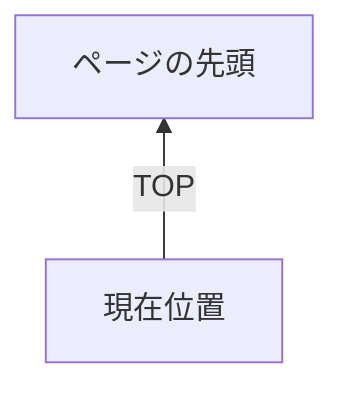
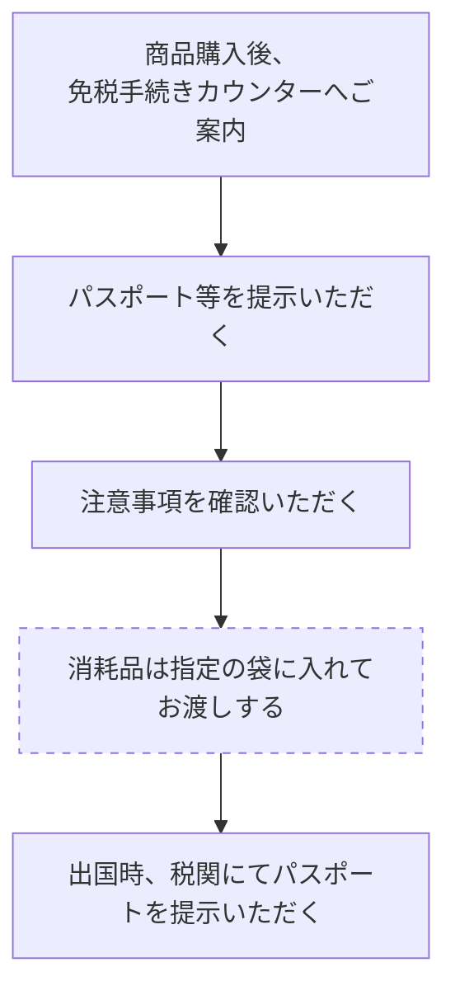

サイドメニュー：
- お支払いに関わる業務
- 金券・小切手の取扱い方
- TOP（上向き矢印ボタン）

---

# 金券・小切手の取扱い方

## 金券
金券とは現金と同様に利用できるものです。それぞれの特徴を覚え、お客さまからの「このギフトカードは使えますか」「お取替券はこの商品に使えますか」というご質問にお答えしましょう。

## お取扱い手順
①有効期限と当社でお取扱いできる金券かどうか確認します。
（わからない時は、金券の裏面の利用店舗で確認します）

②売場でお取扱いできる金券かどうか確認します。金券類の種類などによってお取扱いできない場合があるので、その時はお客さまに丁寧にお断りします。
また、<u>お釣銭がお出しできない金券類の時は、その旨をはっきりお伝えします。</u>

③枚数確認は、必ずお客さまの前で行います。

④現金と同様に両手でお預かりします。
「○○円お預かりいたします」と必ず金額を声に出し、確認をします。
綴り券の場合はそのままお預かりし、お客さまの前で必要金額を切り離してお返しします。

※綴り券すべて使用する場合も必ずお客さまの前で切り離しをします。

⑤レジに入力する際は、「金券○○円」と告げます。

※お釣銭の出せない金券を取扱った際に、客意により不要となったお釣銭は「不要釣銭処理 専用用紙」を使用し、レジ登録を行います。

［サイドバー情報］
お支払いに関わる業務
金券・小切手の取扱い方
［上向き矢印アイコン］TOP

# 金券

［画像：そごう・西武が発行する「全国百貨店共通商品券（¥1,000）」の券面］
そごう・西武商品券

［画像：「全国百貨店共通商品券（¥1000）」の見本の券面］
全国百貨店共通商品券

［画像：西武百貨店が発行する「商品券（金 千圓也 ¥1000）」の券面］
西武百貨店商品券

［画像：そごうが発行する「商品券（¥1,000）」の券面］
そごう商品券

［画像：4種類の異なるデザイン（波線模様のグレー系2種・白系1種、リボン柄1種）の「百貨店ギフトカード」の券面］
百貨店ギフトカード

# 小切手

・小切手の取扱いは、「預金小切手」「普通小切手」「パーソナルチェック」は原則として扱わないが、品渡しまでに5日以上（引き落とし確認）の猶予をいただける場合に限り使用できる。
・小切手を取扱う場合は、必ず会計担当に連絡し、「取扱いの可否」「品渡し可能日」などの確認を行う。

## 小切手

［画像：印字金額「¥5,000,000」などが記載された「預金小切手」の券面］
預金小切手

［画像：印字金額「金参拾万円也」などが記載された「普通小切手」の券面］
普通小切手

［画像：署名欄などが設けられた「パーソナルチェック」の券面］
パーソナルチェック

【サイドメニュー】
お支払いに関わる業務
お支払いの種類（金券）

# お支払いの種類（金券）

| 大分類 | 金券名 | 券種 | 発行元 | 釣銭 |
| --- | --- | --- | --- | --- |
| 自社発行券 | 西武商品券 | 新券 | 発行元：（株）そごう・西武 | 〇 |
| 自社発行券 | そごう商品券 | 新券 | 発行元：（株）そごう・西武 | 〇 |
| 自社発行券 | 西武百貨店商品券（商品券お内渡票を含む） | 旧券 | 発行元：（株）西武百貨店 五番館、旭川、川崎、神戸、富山、だるまや 高知（とでん）、豊橋、本金、有楽町、北陸、北海道、関西（八尾）の各西武発行および東京シティファイナンスも含む | 〇 |
| 自社発行券 | そごう商品券（商品券お内渡票を含む） | 旧券 | 発行元：（株）そごう（※1 旧そごうグループ含む）（※1 旧そごうグループ：大阪店、神戸店、東京店、札幌、千葉、柏、船橋、木更津、茂原、大宮、川口、八王子、多摩、柚木、横浜、長野、豊田、奈良、加古川、西神、廣島、呉、福山、徳島、黒崎、小倉、錦糸町、いよてつ、コトデン） | 〇 |
| 自社発行券 | ギフトカード | 旧券 | 発行元：（株）西武百貨店 五番館、旭川、川崎、神戸、富山、だるまや 高知（とでん）、豊橋、本金、有楽町、北陸、北海道、関西（八尾）の各西武発行も含む | 〇 |
| 自社発行券 | ギフトカード | 旧券 | 発行元：（株）そごう（※1 旧そごうグループ含む） | 〇 |
| 自社発行券 | お買物クーポン | 旧券 | 発行元：（株）そごう（※1 旧そごうグループ含む） | 〇 |
| 自社発行券 | 全国百貨店共通商品券 | 新券 | 発行元：（株）そごう・西武 | 〇 |
| 自社発行券 | 全国百貨店共通商品券 | 旧券 | 発行元：（株）西武百貨店\n発行元：（株）そごう（※1 旧そごうグループ含む） | 〇 |
| 自社発行券 | 百貨店ギフトカード | | 発行元：（株）そごう・西武 | ー |
| 注記 | ※販売出来ない商品：商品券・商品券販売の売掛入金・印紙・切手・ハガキ・金銀地金・地金型コイン等 | | | |

お支払いに関わる業務
お支払いの種類（金券）
TOP

### 自社発行券

| 金券名 | 区分 | 発行元・詳細 | 釣銭 |
| :--- | :--- | :--- | :--- |
| 商品お取替券 | 新券 | 発行元：（株）そごう・西武 | ○ |
| 商品お取替券 | 旧券 | 発行元：（株）そごう（※1 旧そごうグループ含む） | ○ |
| セゾンクラブお買物券 | ★ 友の会 | 発行元：（株）そごう・西武 ※券面上は（株）ファミリィ西武 | ○ |
| セゾンクラブボーナス券 | ★ 友の会 | 発行元：（株）そごう・西武 ※券面上は（株）ファミリィ西武 | ○ |
| セゾンクラブ商品お取替え券 | ★ 友の会 | 発行元：（株）そごう・西武 ※券面上は（株）ファミリィ西武 | ○ |
| ※販売出来ない商品 商品券・売場指定ギフト券※1・食品ギフト券※2・印紙・切手・ハガキ・商品券販売の売掛入金・たばこ・ 金銀地金・地金コイン・屋上売店・遊戯施設・催事など入場料・チケット類・テレフォンカード・旅行サロン・ 請負工事代金・車両・駐車料金・特別注文品・売掛入金・その他指定商品サービス等 | | | |
| セゾンクラブ割引券 | ★ 友の会 | 発行元：（株）そごう・西武 ※券面上は（株）ファミリィ西武 | × |
| ダリア友の会お買物券 | ☆ 友の会 | 発行元：（株）そごう・西武 ※券面上は（株）ダリア友の会 または 　　　　　（株）そごう（※1旧そごうグループ含む） | ○ |
| ダリア友の会お買物カード （プリペイドカード） | ☆ 友の会 | 発行元：（株）そごう・西武 ※友の会事務局にて返金対応、お急ぎのお客様 にはそごう各店商品券売場にて現金で返金。 （法定利息の付与は無し） | ー |
| スマイルカード （プリペイドカード） | 旧券 | 発行元：（株）そごう・西武 お持ちのお客さまがいらしたら、 そごう商品券サロンにて残額分を1,000円単位で そごう商品券へ交換、端数を現金で返金します。 ※西武東戸塚S.C.内のそごうギフトサロンを除く | ー |
| ★☆友の会買物券は、友の会事務所にて現金返金対応（残高＋（残高×法定利息6％）しています。 ★セゾンクラブ 0120-898-929 ☆ダリア友の会 0120-330-348（土日祝日除く午前10時〜午後5時） | | | |

# お支払いに関わる業務
## お支払いの種類（金券）

| 分類 | 詳細 | 釣銭 |
| :--- | :--- | :--- |
| **他社発行券** | **他社発行券** | **他社発行券** |
| **金券名** | **金券名** | **釣銭** |
| 全国百貨店共通商品券 | （回収不可） 大黒屋、上野、丸正、松菱、中三、大牟田松屋、 都城大丸、諏訪丸光、小倉玉屋、大沼、中合、藤丸、 プランタン銀座、一畑、福岡玉屋、ヤナゲン | ○ |
| 百貨店ギフトカード | ー | ー |
| 提携商品券 | クレディセゾン、志澤、ams、緑屋、西武クレジット、 大国屋、ピサ、東京シティファイナンス、松木屋 （回収不可） 鶴丸、西沢本店、サニーマート、西友、LIVIN、 パルコ、藤丸、西條、リウボウ、諏訪丸光 | ○ |
| セブン＆アイ共通商品券 ※2024年2月末をもって回収不可 | 発行元：（株）イトーヨーカドー ※旧「IYグループ共通商品券」の取扱いは出来ません | ○ |
| ※販売出来ない商品 商品券・売場指定ギフト券 ※1・食品ギフト券 ※2・印紙・切手・ハガキ・ 商品券販売の売掛入金・金銀地金・地金型コイン等 | | |
| 銀行・信販系ギフトカード | JCB、UC、VISA、アメリカンエキスプレス 三菱UFJニコス（MUFG・DC・UFJ・ニコス） | × |
| ナイスギフト券 | 発行元：JTB | × |
| びゅう商品券 | 発行元：（株）ビューカード ※19年2月末までの東日本旅客鉄道発行の券も使用可能 | × |
| 農協全国商品券 | ※券裏面の利用店舗に「そごう」記載のある券に限る ※そごう店舗のみ使用可能 | × |
| 日専連 | ※西武店舗のみ使用可能 | × |
| ※販売出来ない商品 商品券・売場指定ギフト券 ※1・食品ギフト券 ※2・印紙・切手・ハガキ・商品券販売の売掛入金・たばこ・ 金銀地金・地金型コイン・屋上売店・遊戯施設・催事など入場料・チケット類・テレフォンカード・旅行サロン・ 請負工事代金・車両・駐車料金・特別注文品・売掛入金・その他指定商品サービス等 | | |

▲ TOP

# お支払いに関わる業務
## お支払いの種類（金券）

| 分類 | 金券名 | （備考） | 釣銭 |
| :--- | :--- | :--- | :---: |
| 売場指定ギフト券※1 | ジェフグルメカード | ※券面および裏面記載事項を確認してください ※券面に指定された商品のみ購入（引換）可能 | 〇 |
| 売場指定ギフト券※1 | 資生堂商品券、ワコールエッセンスチェック、ナルミヤ商品券他 | ※券面および裏面記載事項を確認してください ※券面に指定された商品のみ購入（引換）可能 | × |
| 食品ギフト券※2 | ハム券、ビール券、醤油券、ウイスキー券、アイスクリーム券、お米ギフト券、全国たまごギフト券、清酒券他 | ※券面および裏面記載事項を確認してください ※券面に指定された商品のみ購入（引換）可能 | × |

 

| 分類 | 金券名 | （備考） | 釣銭 |
| :--- | :--- | :--- | :---: |
| 当社発行券 | 西武・そごう特別お買物票 | ＜職域販売用買物票＞ 3,000円（本体価格）以上のお買物金額の合計金額 （100円未満を切り捨て）に5％を掛けた金額を 計算・記入し、金券扱いで使用します。 （1レシートにつき1枚） ただし、返金は不可（商品不良などは除く）  ※ポイント0％ （年間お買上金額、アニバーサリーポイントのみ対象） | － |

**※販売出来ない商品**
商品券・ギフト金券類・たばこ・切手印紙類・金銀地金・食料品、中元／歳暮ギフトセンター商品、
お値引き商品、専門店、レストラン、喫茶、特選ブランド、その他指定商品

 

[TOP （上矢印アイコン）]

【サイドインデックス】
- お支払いに関わる業務
- 百貨店ギフトカードの取扱い方
- [ ∧ TOP ] （ページトップへ戻るボタン）

---

# 百貨店ギフトカードの取扱い方

## 百貨店ギフトカード取扱い時の留意点（一般売場）

◆お支払い前・お支払い後、それぞれの残額をお客さまと必ず確認する
◆一取引につき、3枚まで読み込ませることができる（テナント端末は1枚まで）
◆クラブ・オン／ミレニアムポイントと併用できる（テナント端末を除く）
◆アワー現売でのお支払いにも利用できる（テナントを除く）

### 現金または商品券と併用するとき
◆お支払い種別は、現金・金券を選ぶ
◆ご利用金額の入力は、メインPOSで登録する
◆手順は、「会計時基本の言葉」にならう
◆ポイントカードは、必ずお客さまからカードが見える範囲で取扱う

### クレジットカードと併用するとき
◆お支払い種別は、クレジットカード（内金あり）を選ぶ
◆ご利用金額の入力は、メインPOSで登録する
◆クレジットカード・ポイントカードは、必ずお客さまからカードが見える範囲で取扱う

### 併用できないお支払い種別
◆J-Debit・nanaco・バーコード決済

### 全額使用済の百貨店ギフトカード
◆お客さまにお返しする
◆ただし、お客さまが処分をご希望された場合、メインPOSで残高照会レシートを出力、カードに添付し、会計に提出する

# お支払いに関わる業務
## 百貨店ギフトカードの取扱い方

---

### 百貨店ギフトカード取扱い時の留意点（テナント売場）

◆お支払い前・お支払い後、それぞれの残額をお客さまと必ず確認する
◆一取引につき、1枚まで読み込ませることができる
◆クラブ・オン／ミレニアムポイントと併用できない
◆テナント売場では、百貨店ギフトカードで全額お支払いのみ、利用できる

**併用できないお支払い種別**
◆現金・金券・クレジットカード・J-Debit・nanacoほか、すべてのお支払い種別

**全額使用済の百貨店ギフトカード**
◆お客さまにお返しする
◆ただし、お客さまが処分をご希望された場合、メインPOSで残高照会レシートを出力、カードに添付し、会計に提出する

---

**【重要】**（※黒い三角形に感嘆符が描かれた警告アイコン）
お客さまのお名前や保有ポイント数は個人の情報です。
ご案内の際は周りのお客さまに気を配りながらお伝えしてください。

---

［TOP］（※上向きの矢印と「TOP」の文字が入った円形のトップへ戻るアイコン）

【左側サイドタブ・アイコン情報】
・お支払いに関わる業務
・バーコード決済について
・TOP（上向き矢印アイコン）

---

# バーコード決済について

## 1.コード決済対応ブランド
・決済時は端末種別、ターミナルタイプに依存せず、常に以下のブランドを利用可能です。

| NO | バーコード決済手段 | NO | バーコード決済手段 |
|---|---|---|---|
| 1 | WeChat Pay | 6 | メルペイ |
| 2 | LINE Pay (25年4月23日終了) | 7 | D払い |
| 3 | Alipay+ | 8 | au PAY |
| 4 | 楽天ペイ | 9 | 銀行Pay |
| 5 | PayPay | 10 | J-Coin Pay (銀聯QR決済) |

※2023年10月現在の対応ブランドです。
※決済アプリに関する詳細、対応銀行についてはお客さま自身での確認をご案内してください。

## 2.利用除外商品
※原則はクレジット取扱禁止商品に準ずる

> ◆金券(ビール券・お米券・アイスクリーム券・ジェフグルメカードなど)
> ◆商品券
> ◆金、銀、地金
> ◆プリペイドカード
> ◆印紙
> ◆切手、はがき
> ◆電子マネーチャージ
> ◆たばこ
> ◆宝くじ
> ◆教室・エステ等の、学費・契約費前払方式の商品
> 　※エステティック、美容医療、語学教室、家庭教師、学習塾、結婚相手相談サービス、パソコン教室などサービス・役務の提供でその代金を前払いする方式の商品
> ◆公序良俗に反するもの

## 3.その他決済手段との併用
・現金やクレジットなどのその他の決済手段との併用はできません。
(クラブオン・ミレニアムポイントとの併用は、ポイント利用のみ可能です。)

【サイドインデックス情報】
* 大カテゴリ：お支払いに関わる業務
* 現在の項目：クレジットカード販売の場合
* アイコン：上向き矢印（TOP）

# クレジットカード販売の場合

【重要】（※感嘆符付きの注意喚起アイコン）
お客さまのお名前や保有ポイント数は個人の情報です。
ご案内の際は周りのお客さまに気を配りながらお伝えしてください。

## クレジットカードでのお支払いの手順と対応ポイント

| 手順 | 対応のポイント |
| --- | --- |
| カードのお預かり | ◆カードは必ず両手でお預かりする。 ◆有効期限、カード（会社）名を確認する。 ◆カード（会社）名を声に出して、お預かりする。 ◆お支払い回数を確認する。 　※ボーナス払いの場合は、取扱期間と引落日に注意する。 |
| 必ず暗証番号を入力していただく | ◆金額・支払い回数を口頭で確認し、暗証番号を入力していただきます。 【例外】 ◇視覚障がい等により暗証番号入力が困難な方は、暗証番号入力をスキップし、サイン入力画面も「客意により」と販売員が記載して決済を完了してください。 ◇食品のサインレス取引（1回払いかつ合計金額3万円未満／酒は1万円未満）は暗証番号入力不要。 ◇ICチップの無い磁気のみのカード、一部の海外発行カードはご署名をいただき、クレジットカードのご署名欄と照合します。 　（一部、署名欄の無いカードは照合不要） ◇銀聯カードは暗証番号とご署名の両方が必要です。 |
| カードの返却とお控えのお渡し | ◆先に、クレジットカードをお返しする。 　その際、クレジットカードは表面を上向きにし、両手でお返しする。 ◆お控えも、両手でお渡しする。 |

## 登録後、伝票レス不可能なカードの場合

★打刻された「クレジット販売伝票」をキャッシャーから受け取り、支払区分・回数を確認後作成する
　a. 「クレジット販売伝票」にクレジットカードをインプリントする
　b. 該当カード会社、支払回数に◯、売場名、内線、扱い者名を記入する
　c. 品名欄（お買いあげ商品名、商品コード、数量、単価、税金、合計金額）を記入する
★伝票の打刻内容をお客さまに確認していただき、ご署名をいただく
★お客さまにカードと伝票の「お客様控」をお渡しする
★伝票の「お客様控」以外はキャッシャーに渡す

# お支払いに関わる業務
## クレジットカード販売の場合

### クレジットカード取扱い時の留意点

**販売手続きのとき**
◆クレジットカードは、必ずお客さまからカードが見える範囲で取扱う
◆原則としてタブレットPOSを使用して売上登録をする
◆メインPOSで打刻する場合は、メインPOSの場所までお客さまをご案内する
◆IC付クレジットカードは必ず決済パッドに暗証番号を入力していただく
◆視覚障がい等により暗証番号入力が困難な方は、暗証番号入力をスキップし、サイン入力画面も販売員が「客意により」と記載して決済を完了してください。
◆一部の海外発行カード、銀聯カード、磁気のみカードの場合は、タブレットPOSにご署名をいただく
◆1商品の買上金額の売上票を複数にして分割して計上することは禁止されている
◆本人確認を徹底する。第三者の利用は禁止されている

**エラーメッセージが出るとき**
◆スキャニングおよび手入力時にPOSよりエラー表示された場合は、必ずエラーメッセージを確認する
◆エラーメッセージが表示されたら、販売員はカード会社へ内容・対応の確認をする
◆自動承認番号を取得できないクレジット取引は、必ず電話にて承認番号を取得しなければならない

**食品のサインレス（PINレス）取引**
◆「サインレス対応」を実施してる食品レジ売場では、当社で使用できるクレジットカードの1回払いによるご利用で、かつ合計金額3万円未満（酒は1万円未満）の場合は暗証番号入力を省略することができる（オフライン時は、暗証番号または署名が必要）

**誤打刻をしたとき**
◆クレジット打刻後、支払い回数などに誤りがあった場合は、レシート（クレジット販売伝票）に×印をつけ、×印をつけた人の印鑑を押し、取消処理を行うお客さまにご了承をいただき、正打刻する
◆クレジット売上取引を誤登録取消した場合の顧客対応
　①誤ってクレジット売上を登録したことをお詫びする
　②誤登録取消で出力された「誤登録取消票（お客さま控え※）」をお客さまへ渡し、誤計上したクレジット売上が、確かにマイナスされたことをご説明しお詫びします
　③再打刻を提示し、正しく売上登録されたことを説明し、暗証番号を入力いただいた上でカードとお客さま控えをお渡しします
　※「誤登録取消票（お客さま控え）」は不要と言われた場合は経理控えへ貼付します

[上向き矢印アイコン] TOP

# お支払いに関わる業務
## お支払いの種類（クレジットカード）

---

### お支払いの種類（クレジットカード）

クレジットカードはお金と同様に貴重なものです。
細心の注意を払って取扱いましょう。

■セブンCSカードサービス社発行カード
●クラブ・オン／ミレニアムカード セゾン
●クラブ・オン／ミレニアムカード セゾン　ゴールド
●ミレニアムV.I.P.カードロイヤルセゾン
●アワーカード

①承れる支払い方法：（※１、２、ボ１以外は手数料が発生します）
　１、２、３、５、６、１０、１２、１５、１８、２０、２４回、
　リボ、ボ１、ボ２
②締め日・引落し日：毎月１０日締めの翌月４日引落し
③ボーナス受付期間：
　夏⇒１１/１～５/３１の受付で８/４引落
　冬⇒６/１～１０/３１の受付で翌年１/４引落

■ゴールドカードセゾン

①回数：１、２、３、５、６、１０、１２、１５、１８、２０、２４回、
　リボ、ボ１、ボ２
②毎月１０日締めの翌月４日引落
③夏ボ：１１/１～５/３１⇒８/４、冬ボ⇒６/１～１０/３１⇒翌年１/４

■セゾンカード

①回数：１、２回、リボ、ボ１、ボ２
②毎月１０日締めの翌月４日引落
③夏ボ：１１/１～５/３１⇒８/４、冬ボ⇒６/１～１０/３１⇒翌年１/４

---
（上向き矢印アイコン） TOP

# お支払いに関わる業務
## お支払いの種類（クレジットカード）

同じブランドのカードでも、発行会社や提携先により、締日・
引落日ほかの諸条件が異なる場合がございます。基本的には
お客様より、カード会社にご確認いただくよう、ご案内ください。

**■ダイナースカード**  
①回数：1回、リボ、ボ1
②毎月15日締めの翌月10日引落
③夏ボ：12/16〜6/15⇒8月、冬ボ⇒7/16〜11/15⇒翌年1月

**■JCBカード（※DISCOVERカードは1回払のみ）**  
**■DCカード**  
**■MUFGカード（UFJカード）**  
①回数：1、2、3、5、6、10、12、15、18、20、24回、
　　　　リボ、ボ1(1万以上)
②毎月15日締めの翌月10日引落
③夏ボ：12/16〜6/15⇒8月、冬ボ⇒7/16〜11/15⇒翌年1月

**■三井住友VISAカード**  
**■りそなカードVISA**  
①回数：1、2、3、5、6、10、12、15、18、20、24回、
　　　　リボ、ボ1(1万以上)
②毎月15日締めの翌月10日引落または毎月末締の翌月26日引落
③夏ボ：12/16〜6/15⇒8月、冬ボ⇒7/16〜11/15⇒翌年1月

**■UCカード**  
①回数：1、2、3、5、6、10、12、15、18、20、24回、
　　　　リボ、ボ1(1万以上)
②毎月10日締めの翌月5日引落し
③夏ボ：12/16〜6/15⇒8月、冬ボ⇒7/16〜11/15⇒翌年1月

**■アメリカンエキスプレス(アメックス)カード**  
①回数：1回のみ
②お客様により締日・引落日が異なります。

[TOPアイコン]

# お支払いに関わる業務
## お支払いの種類（クレジットカード）

■トヨタTSキュービックカード
①回数：1、2、3、5、6、10、12、15、18、20、24回、
　リボ、ボ1（1万以上）
②毎月5日締めの翌月2日引落または毎月20日締めの翌月17日引落
③夏ボ：12/16〜6/15⇒8月、冬ボ⇒7/16〜11/15⇒翌年1月

■NICOSカード
①回数：1、2、3、5、6、10、12、15、18、20、24回、
　リボ、ボ1（1万以上）
②毎月5日締めの当月27日
③夏ボ：12/16〜6/15⇒7月、冬ボ⇒7/16〜11/15⇒12月

■オリコカード（西武のみ）
①回数：1、2、3、5、6、10、12、15、18、20、24回、
　リボ、ボ1（1万以上）
②毎月末日締めの翌月27日
③夏ボ：12/16〜6/15⇒7月、冬ボ⇒7/16〜11/15⇒12月

■ジャックスカード（西武のみ）
①回数：リボ、ボ1（1万以上）
②毎月末日締めの翌月27日
③夏ボ：12/16〜6/15⇒7月、冬ボ⇒7/16〜11/15⇒12月
※JCB・VISA・マスター等のブランド付ジャックスカードは支払上記と異なります。

■日専連カード（西武のみ）
①回数：1、2、3、5、6、10、12、15、20回、
　リボ、ボ1（1万以上）
②締日・引落日は発行会社により異なります
③夏ボ：12/16〜6/15、冬ボ⇒7/16〜11/15

■その他VISA/Master（記載の無い発行会社）
発行会社により、支払い方法、カード締日等異なりますので、お客様より、
カード会社に確認いただいてください。

[上向きの山括弧とTOPと書かれたトップへ戻るボタンのアイコン]

お支払いに関わる業務
お支払いの種類（クレジットカード）

# JCB、VISA、Master／デビットカード・プリペイドカードの取扱いについて

JCB、VISA、Master カードと金融機関等が提携したデビットカードとプリペイドカードが発行されています。
店頭では、<u>クレジットカード（JCB、VISA、Master カード）と同様に取扱います</u>が、お支払い時期等が異なりますのでカードの特性を理解しましょう。

| カードブランド | JCB | VISA/Master | VISA/Master |
|---|---|---|---|
| カードの種類 | デビットカード | デビットカード | プリペイドカード |
| ブランドロゴ | JCB ロゴの下に「DEBIT」と表記 | VISA/Master カードのロゴ（カード券面による特定は困難です） | VISA/Master カードのロゴ（カード券面による特定は困難です） |
| 承れる支払方法 | 1 回払いのみ | 1 回払いのみ | 1 回払いのみ |
| お客様の支払時期 | カードご利用時にお客様の銀行口座から即時に引き落とし | カードご利用時にお客様の銀行口座から即時に引き落とし | カードご利用時にカード残高を減額 |
| 返品時（自動戻り） | 口座に即時入金 | カード発行金融機関により入金時期が異なります | カード発行金融機関により入金時期が異なります |
| 返品時（明細戻り） | 3 〜 7 日後に入金 | カード発行金融機関により入金時期が異なります | カード発行金融機関により入金時期が異なります |
| 承認番号の取得先（問合せ先） | JCB オーソリセンター 0120-301-361 | VISA/Master オーソリセンター（クレディセゾン） 03-5996-9106 | VISA/Master オーソリセンター（クレディセゾン） 03-5996-9106 |
| お客様からの問合せについて | 「カードが利用できない」「口座に返金されていない」「残高はいくらか」等お客様からのお問合せは、<u>「お客様のカード裏面に記載の発行金融機関までお問合せください」</u>とご案内してください。 | 「カードが利用できない」「口座に返金されていない」「残高はいくらか」等お客様からのお問合せは、<u>「お客様のカード裏面に記載の発行金融機関までお問合せください」</u>とご案内してください。 | 「カードが利用できない」「口座に返金されていない」「残高はいくらか」等お客様からのお問合せは、<u>「お客様のカード裏面に記載の発行金融機関までお問合せください」</u>とご案内してください。 |

[TOPへ戻る（上向き矢印アイコン）]

お支払いに関わる業務
お支払いの種類（クレジットカード）

# セブン銀行発行「デビット付きキャッシュカード」の取扱いについて

［画像：セブン銀行発行の「デビット付きキャッシュカード」の表面。カードには、セブン銀行のロゴ、ICチップ、カード番号「3573 1234 5678 9012」、有効期限「00/00」、氏名「TARO SEVEN」、JCBのロゴ、および「DEBIT」の文字が記載されています。］

セブン銀行が発行している「デビット付きキャッシュカード」は、「デビット払い」と「nanaco払い」の２つのお支払方法が利用可能です。お客さまからの①「デビット利用」 ②「nanaco利用」のお申し出に対して、「POSレジ」や端末の操作を誤らないように注意しましょう。

## ①「デビット払い」の場合
レジで「クレジット払い」を選択して、レジの読取機にスキャンしてください。（クレジットカードと同様の操作です。）

## ②「nanaco払い」の場合
レジで「nanaco払い」を選択して、nanacoのマルチリーダライターにカードをかざしてください。通常のnanacoカード同様にチャージも可能です。

---

**セブン銀行**
**「デビット付きキャッシュカード」の留意点**

「セブン銀行　デビット付きキャッシュカード」は、デビット機能でのお支払いの際にご利用金額（税込）に応じた「nanacoポイント」が貯まります。ご利用にあたっての付与ポイント、加盟店は下記の通りです。

【ご利用金額の1.0%】そごう・西武（食品・専門店を除く）、セブンネットショッピング、セブン-イレブン
【ご利用金額の0.5%】そごう・西武（食品・専門店）、その他JCB加盟店

---

［画像：上向きの矢印と「TOP」の文字が記載されたページトップへ戻るためのアイコン］

【サイドメニュー】
お支払いに関わる業務
カード会社連絡先

■カード会社連絡先

| カード会社 | 承認番号 連絡先（1） | 承認番号 連絡先（2） | 備　考 |
| --- | --- | --- | --- |
| クレディセゾン | 03-5996-9106（共通） | | |
| ダイナース | 0570-031-555（共通） | 03-6770-2400 | 海外カードを含む |
| JCB/DISCOVER | 0120-301-361（共通） | | 海外カードを含む |
| DC | 0570-783-178（共通） | | （連絡先：三菱UFJニコス） |
| VISA （三井住友・りそな） | 03-5392-7300（東京） 06-6445-3535（大阪） | 082-245-3254（広島） 0570-001-230（共通） | （連絡先：三井住友カード） |
| MUFG・UFJ | 0120-950-808（共通） | | （連絡先：三菱UFJニコス） |
| UC | 0570-064-822（共通） | | |
| アメックス | 0120-376-100（共通） | | 海外カードを含む |
| トヨタ TS キュービック | 0570-073-073（共通） | | |
| NICOS | 0570-783-174（共通） | | （連絡先：三菱UFJニコス） |
| VISA / Master （上記以外の発行会社） | 03-5996-9106（共通） | | 海外カードを含む （連絡先：クレディセゾン） |

上記以外の各地域センターでも連絡可能です。
オフライン、カード磁気不良などの場合は、上記の連絡先へ電話し、承認番号を取得してください。

※画面左下には、ページ上部へ戻るための、上向きの矢印と「TOP」の文字が描かれた丸いボタンアイコンが配置されています。

# お支払いに関わる業務
## カード会社連絡先

| カード会社 | 承認番号 連絡先 | 備 考 |
| :--- | :--- | :--- |
| オリコ | 0120-349-120（共通） | 西武のみ |
| JACCS | 0120-975-950（共通） | 西武のみ |
| 日専連 | 03-3255-6661（東京） | 西武のみ |
| 銀聯 | ■お客さま専用問合せ先 銀聯コールセンター（中国語） 0034-800-800-287 （通話料無料：24時間対応） | |
| | ■銀聯専用端末操作以外の問合せ先 加盟店受付デスク 06-6223-6530（共通）のみ | 受付時間 9:00〜17:00 土日祝、12/31 〜1/3を除く |

上記以外の各地域センターでも連絡可能です。
オフライン、カード磁気不良などの場合は、上記の連絡先へ電話し、承認番号を取得してください。

| | | |
| :--- | :--- | :--- |
| ■銀聯専用端末操作に関する 問合せ先 GMOフィナンシャルゲートヘルプデスク | 0120-044-877 | 24時間対応 |

※2024年2月以降導入の、新しい銀聯専用端末（パナソニックJT-C60）の問合せ先です。
旧端末（INFOX）は INFOXヘルプデスク（0120-832-501）までお願いします。

> **【重要】 外線電話をかける時の注意**
> ・内線電話から外線に電話をする場合、必ず「0」を押してから市外局番をかけるように注意しましょう。

[TOP]

その他販売手続き業務
免税の知識
（上矢印アイコン）TOP

# 免税の知識

## 言葉よりも気持ちが大切です。
大切なことは、笑顔でお迎えし、お客さまの目をみて対応することです。お客さまに対する接客の基本は、日本人であろうと外国人であろうと変わりません。おもてなしの心は表情で伝わります。優しい笑顔でお客さまをお迎えしましょう。

| 項目 | 一般物品 | 消耗品 |
| --- | --- | --- |
| 申請対象者 | 日本国内非居住者で購入されたご本人（代理人不可） ・日本に居住していない滞在６カ月未満の外国人 　※在留資格「短期滞在」「外交」「公用」等に限る ・海外に２年以上居住している滞在６カ月未満の一時帰国の日本人 | 日本国内非居住者で購入されたご本人（代理人不可） ・日本に居住していない滞在６カ月未満の外国人 　※在留資格「短期滞在」「外交」「公用」等に限る ・海外に２年以上居住している滞在６カ月未満の一時帰国の日本人 |
| 申請期間 | お買い上げ当日のみ（各店舗の営業時間中） | お買い上げ当日のみ（各店舗の営業時間中） |
| 対象商品・金額条件（修理・加工代は除く） | 靴、バッグ、衣料品、時計、宝飾品等 | 食品類、飲料類、化粧品、薬品等 |
| 対象商品・金額条件（修理・加工代は除く） | ５,０００円以上（本体価格） | ５,０００円〜５００,０００円（本体価格） |
| 梱包 | 指定なし | 免税カウンターで特殊梱包 |
| 免税除外品 | 専門店（賃貸借テナント）の商品　※一部専門店は独自で免税対応実施、飲食代、加工修理代、送料 | 専門店（賃貸借テナント）の商品　※一部専門店は独自で免税対応実施、飲食代、加工修理代、送料 |
| ご提示いただくもの | ①ご本人のパスポート 　（コピー不可・入国スタンプ（証印）必要） ※日本人海外居住者は「戸籍の附票の写し」または「在留証明」が必要（いずれも原本） ※乗務員の方は「乗員上陸許可書」が必要 ※外交官の方は免税カードの提示が必要（外交官免税実施店舗のみ） ②お買い上げレシート（領収証は不可） ③ご購入品 ④ご利用のクレジットカード（ご利用の場合） ※クレジットカードはパスポートと同名義のもの・法人カードは利用不可 | ①ご本人のパスポート 　（コピー不可・入国スタンプ（証印）必要） ※日本人海外居住者は「戸籍の附票の写し」または「在留証明」が必要（いずれも原本） ※乗務員の方は「乗員上陸許可書」が必要 ※外交官の方は免税カードの提示が必要（外交官免税実施店舗のみ） ②お買い上げレシート（領収証は不可） ③ご購入品 ④ご利用のクレジットカード（ご利用の場合） ※クレジットカードはパスポートと同名義のもの・法人カードは利用不可 |
| その他 | ・個人使用の目的で購入された物品（商用目的不可）で、帰国の際に日本から持ち出される物品のみ対象 | ・個人使用の目的で購入された物品（商用目的不可）で、帰国の際に日本から持ち出される物品のみ対象 |

# その他販売手続き業務
## 免税の知識

### 手続きに必要なもの
①購入商品
（ハンドバッグのイラスト）

②ご本人のパスポート（入国スタンプ必要）
（「日本国旅券 JAPAN PASSPORT」と記載されたパスポートのイラスト）

③レシート（領収証不可）
（２枚のレシートのイラスト）

④ご利用カード（クレジット等ご利用の場合）
（「CREDIT CARD 0000 0000 0000 0000」と記載されたクレジットカードのイラスト）

### 免税の手続き方法

※２０２３年１１月時点の情報です。

### 免税対象商品と免税購入額

| 組合せ | 商品１ | 記号 | 商品２ | 結果 |
| --- | --- | --- | --- | --- |
| 一般物品同士の 組合せ | （パンプスのイラスト） 3,000円 | ＋ | （ワンピースのイラスト） 2,000円 | （背景に◯のマーク） 免税になります |
| 消耗品同士の 組合せ | （口紅・化粧水などのイラスト） 3,000円 | ＋ | （クッキーなどのお菓子のイラスト） 2,000円 | （背景に◯のマーク） 免税になります ※要特殊梱包 |
| 一般物品と 消耗品の組合せ | （パンプスのイラスト） 3,000円 | ＋ | （クッキーなどのお菓子のイラスト） 2,000円 | （背景に◯のマーク） 免税になります ※要特殊梱包 |

※一般物品と消耗品の組合せで5,000円以上（本体価格）になる場合は免税カウンターで特殊梱包。

私の店の免税カウンターは ［　　　　　　］ 階です。
内線（　　　　　　）

（上向き矢印のTOPアイコン画像）