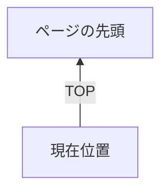
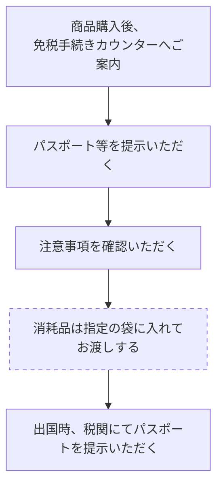

表の疑似JSON変換メモ: 元のMarkdown表は、LLMが行・列・注記の関係を失わず読めるよう疑似JSONへ置換しています。
疑似JSON: {"source_file":"sales-basic-rules_pages-65-82_108-109.md","source_pdf":"output/pdf/sales-basic-rules_pages-65-82_108-109.pdf","conversion_policy":"Markdown表は、チャンク分割時に列軸・行軸が失われないよう、各行または各比較対象を1レコードの疑似JSONとして展開。原表の空欄は「記載なし（原表空欄）」として保持し、表内見出し・注記・結合セル相当の空欄は補足して記載。","record_count":85,"table_count":13,"page_tag_policy":"回答に使用した根拠ページを、回答末尾に [page_65] の形式で出力する。複数根拠の場合は [page_65][page_70] のように連続して出力する。","available_page_tags":[{"tag":"page_65","sourcePage":65,"pdfPage":1,"label":"p.65 金券・小切手の取扱い方"},{"tag":"page_66","sourcePage":66,"pdfPage":2,"label":"p.66 金券・小切手の券面例"},{"tag":"page_67","sourcePage":67,"pdfPage":3,"label":"p.67 お支払いの種類（金券） 自社発行券一覧"},{"tag":"page_68","sourcePage":68,"pdfPage":4,"label":"p.68 お支払いの種類（金券） 自社発行券・友の会券"},{"tag":"page_69","sourcePage":69,"pdfPage":5,"label":"p.69 お支払いの種類（金券） 他社発行券"},{"tag":"page_70","sourcePage":70,"pdfPage":6,"label":"p.70 お支払いの種類（金券） 売場指定ギフト券・食品ギフト券・特別お買物票"},{"tag":"page_71","sourcePage":71,"pdfPage":7,"label":"p.71 百貨店ギフトカードの取扱い方（一般売場）"},{"tag":"page_72","sourcePage":72,"pdfPage":8,"label":"p.72 百貨店ギフトカードの取扱い方（テナント売場）"},{"tag":"page_73","sourcePage":73,"pdfPage":9,"label":"p.73 バーコード決済について"},{"tag":"page_74","sourcePage":74,"pdfPage":10,"label":"p.74 クレジットカード販売の場合"},{"tag":"page_75","sourcePage":75,"pdfPage":11,"label":"p.75 クレジットカード取扱い時の留意点"},{"tag":"page_76","sourcePage":76,"pdfPage":12,"label":"p.76 お支払いの種類（クレジットカード） 自社カード"},{"tag":"page_77","sourcePage":77,"pdfPage":13,"label":"p.77 お支払いの種類（クレジットカード） 他社カード前半"},{"tag":"page_78","sourcePage":78,"pdfPage":14,"label":"p.78 お支払いの種類（クレジットカード） 他社カード後半"},{"tag":"page_79","sourcePage":79,"pdfPage":15,"label":"p.79 JCB/VISA/Master・デビットカード・プリペイドカード"},{"tag":"page_80","sourcePage":80,"pdfPage":16,"label":"p.80 セブン銀行発行「デビット付きキャッシュカード」"},{"tag":"page_81","sourcePage":81,"pdfPage":17,"label":"p.81 カード会社連絡先（主要カード会社）"},{"tag":"page_82","sourcePage":82,"pdfPage":18,"label":"p.82 カード会社連絡先（西武のみ・銀聯）"},{"tag":"page_108","sourcePage":108,"pdfPage":19,"label":"p.108 免税の知識"},{"tag":"page_109","sourcePage":109,"pdfPage":20,"label":"p.109 免税の手続き方法・免税対象商品と免税購入額"}],"english_tax_free_record_count":9,"english_tax_free_pages":["page_108","page_109"],"english_tax_free_policy":"Pages 108-109 are for foreign-customer tax-free guidance. English pseudoJSON records are appended for English answers about tax-free procedures only."}

---

サイドメニュー：
- お支払いに関わる業務
- 金券・小切手の取扱い方
- TOP（上向き矢印ボタン）

---

# 金券・小切手の取扱い方

## 金券
金券とは現金と同様に利用できるものです。それぞれの特徴を覚え、お客さまからの「このギフトカードは使えますか」「お取替券はこの商品に使えますか」というご質問にお答えしましょう。

## お取扱い手順
①有効期限と当社でお取扱いできる金券かどうか確認します。
（わからない時は、金券の裏面の利用店舗で確認します）

②売場でお取扱いできる金券かどうか確認します。金券類の種類などによってお取扱いできない場合があるので、その時はお客さまに丁寧にお断りします。
また、<u>お釣銭がお出しできない金券類の時は、その旨をはっきりお伝えします。</u>

③枚数確認は、必ずお客さまの前で行います。

④現金と同様に両手でお預かりします。
「○○円お預かりいたします」と必ず金額を声に出し、確認をします。
綴り券の場合はそのままお預かりし、お客さまの前で必要金額を切り離してお返しします。

※綴り券すべて使用する場合も必ずお客さまの前で切り離しをします。

⑤レジに入力する際は、「金券○○円」と告げます。

※お釣銭の出せない金券を取扱った際に、客意により不要となったお釣銭は「不要釣銭処理 専用用紙」を使用し、レジ登録を行います。

［サイドバー情報］
お支払いに関わる業務
金券・小切手の取扱い方
［上向き矢印アイコン］TOP

# 金券

［画像：そごう・西武が発行する「全国百貨店共通商品券（¥1,000）」の券面］
そごう・西武商品券

［画像：「全国百貨店共通商品券（¥1000）」の見本の券面］
全国百貨店共通商品券

［画像：西武百貨店が発行する「商品券（金 千圓也 ¥1000）」の券面］
西武百貨店商品券

［画像：そごうが発行する「商品券（¥1,000）」の券面］
そごう商品券

［画像：4種類の異なるデザイン（波線模様のグレー系2種・白系1種、リボン柄1種）の「百貨店ギフトカード」の券面］
百貨店ギフトカード

# 小切手

・小切手の取扱いは、「預金小切手」「普通小切手」「パーソナルチェック」は原則として扱わないが、品渡しまでに5日以上（引き落とし確認）の猶予をいただける場合に限り使用できる。
・小切手を取扱う場合は、必ず会計担当に連絡し、「取扱いの可否」「品渡し可能日」などの確認を行う。

## 小切手

［画像：印字金額「¥5,000,000」などが記載された「預金小切手」の券面］
預金小切手

［画像：印字金額「金参拾万円也」などが記載された「普通小切手」の券面］
普通小切手

［画像：署名欄などが設けられた「パーソナルチェック」の券面］
パーソナルチェック

【サイドメニュー】
お支払いに関わる業務
お支払いの種類（金券）

# お支払いの種類（金券）

疑似JSON: {"文書":"西武・そごう 販売基本ルールAI","表ID":"table_001","表題":"お支払いの種類（金券） 自社発行券一覧","行番号":1,"種別":"金券取扱可否・釣銭可否","参照用途":"自社発行券の券種、発行元、釣銭可否、販売できない商品を確認するとき。","データ":{"行種別":"明細","大分類":"自社発行券","金券名":"西武商品券","券種":"新券","発行元":"発行元：（株）そごう・西武","釣銭":"〇"},"解釈":{"釣銭":"釣銭あり"},"表注":["百貨店ギフトカードの釣銭欄は横棒。現金の釣銭を出す対象ではない。"],"参照ページタグ":"page_67","原PDFページ":67,"抽出PDFページ":3,"参照ページ見出し":"お支払いの種類（金券） 自社発行券一覧","参照PDF":"output/pdf/sales-basic-rules_pages-65-82_108-109.pdf","回答末尾タグ指示":"このレコードを根拠に回答する場合は、回答末尾に [page_67] を付ける。"}
疑似JSON: {"文書":"西武・そごう 販売基本ルールAI","表ID":"table_001","表題":"お支払いの種類（金券） 自社発行券一覧","行番号":2,"種別":"金券取扱可否・釣銭可否","参照用途":"自社発行券の券種、発行元、釣銭可否、販売できない商品を確認するとき。","データ":{"行種別":"明細","大分類":"自社発行券","金券名":"そごう商品券","券種":"新券","発行元":"発行元：（株）そごう・西武","釣銭":"〇"},"解釈":{"釣銭":"釣銭あり"},"表注":["百貨店ギフトカードの釣銭欄は横棒。現金の釣銭を出す対象ではない。"],"参照ページタグ":"page_67","原PDFページ":67,"抽出PDFページ":3,"参照ページ見出し":"お支払いの種類（金券） 自社発行券一覧","参照PDF":"output/pdf/sales-basic-rules_pages-65-82_108-109.pdf","回答末尾タグ指示":"このレコードを根拠に回答する場合は、回答末尾に [page_67] を付ける。"}
疑似JSON: {"文書":"西武・そごう 販売基本ルールAI","表ID":"table_001","表題":"お支払いの種類（金券） 自社発行券一覧","行番号":3,"種別":"金券取扱可否・釣銭可否","参照用途":"自社発行券の券種、発行元、釣銭可否、販売できない商品を確認するとき。","データ":{"行種別":"明細","大分類":"自社発行券","金券名":"西武百貨店商品券（商品券お内渡票を含む）","券種":"旧券","発行元":"発行元：（株）西武百貨店 五番館、旭川、川崎、神戸、富山、だるまや 高知（とでん）、豊橋、本金、有楽町、北陸、北海道、関西（八尾）の各西武発行および東京シティファイナンスも含む","釣銭":"〇"},"解釈":{"釣銭":"釣銭あり"},"表注":["百貨店ギフトカードの釣銭欄は横棒。現金の釣銭を出す対象ではない。"],"参照ページタグ":"page_67","原PDFページ":67,"抽出PDFページ":3,"参照ページ見出し":"お支払いの種類（金券） 自社発行券一覧","参照PDF":"output/pdf/sales-basic-rules_pages-65-82_108-109.pdf","回答末尾タグ指示":"このレコードを根拠に回答する場合は、回答末尾に [page_67] を付ける。"}
疑似JSON: {"文書":"西武・そごう 販売基本ルールAI","表ID":"table_001","表題":"お支払いの種類（金券） 自社発行券一覧","行番号":4,"種別":"金券取扱可否・釣銭可否","参照用途":"自社発行券の券種、発行元、釣銭可否、販売できない商品を確認するとき。","データ":{"行種別":"明細","大分類":"自社発行券","金券名":"そごう商品券（商品券お内渡票を含む）","券種":"旧券","発行元":"発行元：（株）そごう（※1 旧そごうグループ含む）（※1 旧そごうグループ：大阪店、神戸店、東京店、札幌、千葉、柏、船橋、木更津、茂原、大宮、川口、八王子、多摩、柚木、横浜、長野、豊田、奈良、加古川、西神、廣島、呉、福山、徳島、黒崎、小倉、錦糸町、いよてつ、コトデン）","釣銭":"〇"},"解釈":{"釣銭":"釣銭あり"},"表注":["百貨店ギフトカードの釣銭欄は横棒。現金の釣銭を出す対象ではない。"],"参照ページタグ":"page_67","原PDFページ":67,"抽出PDFページ":3,"参照ページ見出し":"お支払いの種類（金券） 自社発行券一覧","参照PDF":"output/pdf/sales-basic-rules_pages-65-82_108-109.pdf","回答末尾タグ指示":"このレコードを根拠に回答する場合は、回答末尾に [page_67] を付ける。"}
疑似JSON: {"文書":"西武・そごう 販売基本ルールAI","表ID":"table_001","表題":"お支払いの種類（金券） 自社発行券一覧","行番号":5,"種別":"金券取扱可否・釣銭可否","参照用途":"自社発行券の券種、発行元、釣銭可否、販売できない商品を確認するとき。","データ":{"行種別":"明細","大分類":"自社発行券","金券名":"ギフトカード","券種":"旧券","発行元":"発行元：（株）西武百貨店 五番館、旭川、川崎、神戸、富山、だるまや 高知（とでん）、豊橋、本金、有楽町、北陸、北海道、関西（八尾）の各西武発行も含む","釣銭":"〇"},"解釈":{"釣銭":"釣銭あり"},"表注":["百貨店ギフトカードの釣銭欄は横棒。現金の釣銭を出す対象ではない。"],"参照ページタグ":"page_67","原PDFページ":67,"抽出PDFページ":3,"参照ページ見出し":"お支払いの種類（金券） 自社発行券一覧","参照PDF":"output/pdf/sales-basic-rules_pages-65-82_108-109.pdf","回答末尾タグ指示":"このレコードを根拠に回答する場合は、回答末尾に [page_67] を付ける。"}
疑似JSON: {"文書":"西武・そごう 販売基本ルールAI","表ID":"table_001","表題":"お支払いの種類（金券） 自社発行券一覧","行番号":6,"種別":"金券取扱可否・釣銭可否","参照用途":"自社発行券の券種、発行元、釣銭可否、販売できない商品を確認するとき。","データ":{"行種別":"明細","大分類":"自社発行券","金券名":"ギフトカード","券種":"旧券","発行元":"発行元：（株）そごう（※1 旧そごうグループ含む）","釣銭":"〇"},"解釈":{"釣銭":"釣銭あり"},"表注":["百貨店ギフトカードの釣銭欄は横棒。現金の釣銭を出す対象ではない。"],"参照ページタグ":"page_67","原PDFページ":67,"抽出PDFページ":3,"参照ページ見出し":"お支払いの種類（金券） 自社発行券一覧","参照PDF":"output/pdf/sales-basic-rules_pages-65-82_108-109.pdf","回答末尾タグ指示":"このレコードを根拠に回答する場合は、回答末尾に [page_67] を付ける。"}
疑似JSON: {"文書":"西武・そごう 販売基本ルールAI","表ID":"table_001","表題":"お支払いの種類（金券） 自社発行券一覧","行番号":7,"種別":"金券取扱可否・釣銭可否","参照用途":"自社発行券の券種、発行元、釣銭可否、販売できない商品を確認するとき。","データ":{"行種別":"明細","大分類":"自社発行券","金券名":"お買物クーポン","券種":"旧券","発行元":"発行元：（株）そごう（※1 旧そごうグループ含む）","釣銭":"〇"},"解釈":{"釣銭":"釣銭あり"},"表注":["百貨店ギフトカードの釣銭欄は横棒。現金の釣銭を出す対象ではない。"],"参照ページタグ":"page_67","原PDFページ":67,"抽出PDFページ":3,"参照ページ見出し":"お支払いの種類（金券） 自社発行券一覧","参照PDF":"output/pdf/sales-basic-rules_pages-65-82_108-109.pdf","回答末尾タグ指示":"このレコードを根拠に回答する場合は、回答末尾に [page_67] を付ける。"}
疑似JSON: {"文書":"西武・そごう 販売基本ルールAI","表ID":"table_001","表題":"お支払いの種類（金券） 自社発行券一覧","行番号":8,"種別":"金券取扱可否・釣銭可否","参照用途":"自社発行券の券種、発行元、釣銭可否、販売できない商品を確認するとき。","データ":{"行種別":"明細","大分類":"自社発行券","金券名":"全国百貨店共通商品券","券種":"新券","発行元":"発行元：（株）そごう・西武","釣銭":"〇"},"解釈":{"釣銭":"釣銭あり"},"表注":["百貨店ギフトカードの釣銭欄は横棒。現金の釣銭を出す対象ではない。"],"参照ページタグ":"page_67","原PDFページ":67,"抽出PDFページ":3,"参照ページ見出し":"お支払いの種類（金券） 自社発行券一覧","参照PDF":"output/pdf/sales-basic-rules_pages-65-82_108-109.pdf","回答末尾タグ指示":"このレコードを根拠に回答する場合は、回答末尾に [page_67] を付ける。"}
疑似JSON: {"文書":"西武・そごう 販売基本ルールAI","表ID":"table_001","表題":"お支払いの種類（金券） 自社発行券一覧","行番号":9,"種別":"金券取扱可否・釣銭可否","参照用途":"自社発行券の券種、発行元、釣銭可否、販売できない商品を確認するとき。","データ":{"行種別":"明細","大分類":"自社発行券","金券名":"全国百貨店共通商品券","券種":"旧券","発行元":["発行元：（株）西武百貨店","発行元：（株）そごう（※1 旧そごうグループ含む）"],"釣銭":"〇"},"解釈":{"釣銭":"釣銭あり"},"表注":["百貨店ギフトカードの釣銭欄は横棒。現金の釣銭を出す対象ではない。"],"参照ページタグ":"page_67","原PDFページ":67,"抽出PDFページ":3,"参照ページ見出し":"お支払いの種類（金券） 自社発行券一覧","参照PDF":"output/pdf/sales-basic-rules_pages-65-82_108-109.pdf","回答末尾タグ指示":"このレコードを根拠に回答する場合は、回答末尾に [page_67] を付ける。"}
疑似JSON: {"文書":"西武・そごう 販売基本ルールAI","表ID":"table_001","表題":"お支払いの種類（金券） 自社発行券一覧","行番号":10,"種別":"金券取扱可否・釣銭可否","参照用途":"自社発行券の券種、発行元、釣銭可否、販売できない商品を確認するとき。","データ":{"行種別":"明細","大分類":"自社発行券","金券名":"百貨店ギフトカード","券種":"記載なし（原表空欄）","発行元":"発行元：（株）そごう・西武","釣銭":"ー"},"解釈":{"釣銭":"釣銭なしまたは該当なし"},"表注":["百貨店ギフトカードの釣銭欄は横棒。現金の釣銭を出す対象ではない。"],"参照ページタグ":"page_67","原PDFページ":67,"抽出PDFページ":3,"参照ページ見出し":"お支払いの種類（金券） 自社発行券一覧","参照PDF":"output/pdf/sales-basic-rules_pages-65-82_108-109.pdf","回答末尾タグ指示":"このレコードを根拠に回答する場合は、回答末尾に [page_67] を付ける。"}
疑似JSON: {"文書":"西武・そごう 販売基本ルールAI","表ID":"table_001","表題":"お支払いの種類（金券） 自社発行券一覧","行番号":11,"種別":"金券取扱可否・釣銭可否","参照用途":"自社発行券の券種、発行元、釣銭可否、販売できない商品を確認するとき。","データ":{"行種別":"明細","大分類":"注記","金券名":"※販売出来ない商品：商品券・商品券販売の売掛入金・印紙・切手・ハガキ・金銀地金・地金型コイン等","券種":"記載なし（原表空欄）","発行元":"記載なし（原表空欄）","釣銭":"記載なし（原表空欄）"},"解釈":{"釣銭":"記載なし（原表空欄）"},"表注":["百貨店ギフトカードの釣銭欄は横棒。現金の釣銭を出す対象ではない。"],"参照ページタグ":"page_67","原PDFページ":67,"抽出PDFページ":3,"参照ページ見出し":"お支払いの種類（金券） 自社発行券一覧","参照PDF":"output/pdf/sales-basic-rules_pages-65-82_108-109.pdf","回答末尾タグ指示":"このレコードを根拠に回答する場合は、回答末尾に [page_67] を付ける。"}

お支払いに関わる業務
お支払いの種類（金券）
TOP

### 自社発行券

疑似JSON: {"文書":"西武・そごう 販売基本ルールAI","表ID":"table_002","表題":"自社発行券 商品お取替券・友の会券","行番号":1,"種別":"自社発行券・友の会券の取扱い","参照用途":"商品お取替券、セゾンクラブ券、ダリア友の会券、プリペイドカード等の発行元と釣銭可否を確認するとき。","データ":{"行種別":"明細","金券名":"商品お取替券","区分":"新券","発行元・詳細":"発行元：（株）そごう・西武","釣銭":"○"},"解釈":{"釣銭":"釣銭あり"},"表注":["友の会買物券は、友の会事務所にて現金返金対応（残高＋残高×法定利息6％）。","セゾンクラブ連絡先: 0120-898-929。","ダリア友の会連絡先: 0120-330-348（土日祝日除く午前10時〜午後5時）。"],"参照ページタグ":"page_68","原PDFページ":68,"抽出PDFページ":4,"参照ページ見出し":"お支払いの種類（金券） 自社発行券・友の会券","参照PDF":"output/pdf/sales-basic-rules_pages-65-82_108-109.pdf","回答末尾タグ指示":"このレコードを根拠に回答する場合は、回答末尾に [page_68] を付ける。"}
疑似JSON: {"文書":"西武・そごう 販売基本ルールAI","表ID":"table_002","表題":"自社発行券 商品お取替券・友の会券","行番号":2,"種別":"自社発行券・友の会券の取扱い","参照用途":"商品お取替券、セゾンクラブ券、ダリア友の会券、プリペイドカード等の発行元と釣銭可否を確認するとき。","データ":{"行種別":"明細","金券名":"商品お取替券","区分":"旧券","発行元・詳細":"発行元：（株）そごう（※1 旧そごうグループ含む）","釣銭":"○"},"解釈":{"釣銭":"釣銭あり"},"表注":["友の会買物券は、友の会事務所にて現金返金対応（残高＋残高×法定利息6％）。","セゾンクラブ連絡先: 0120-898-929。","ダリア友の会連絡先: 0120-330-348（土日祝日除く午前10時〜午後5時）。"],"参照ページタグ":"page_68","原PDFページ":68,"抽出PDFページ":4,"参照ページ見出し":"お支払いの種類（金券） 自社発行券・友の会券","参照PDF":"output/pdf/sales-basic-rules_pages-65-82_108-109.pdf","回答末尾タグ指示":"このレコードを根拠に回答する場合は、回答末尾に [page_68] を付ける。"}
疑似JSON: {"文書":"西武・そごう 販売基本ルールAI","表ID":"table_002","表題":"自社発行券 商品お取替券・友の会券","行番号":3,"種別":"自社発行券・友の会券の取扱い","参照用途":"商品お取替券、セゾンクラブ券、ダリア友の会券、プリペイドカード等の発行元と釣銭可否を確認するとき。","データ":{"行種別":"明細","金券名":"セゾンクラブお買物券","区分":["★","友の会"],"発行元・詳細":["発行元：（株）そごう・西武","※券面上は（株）ファミリィ西武"],"釣銭":"○"},"解釈":{"釣銭":"釣銭あり"},"表注":["友の会買物券は、友の会事務所にて現金返金対応（残高＋残高×法定利息6％）。","セゾンクラブ連絡先: 0120-898-929。","ダリア友の会連絡先: 0120-330-348（土日祝日除く午前10時〜午後5時）。"],"参照ページタグ":"page_68","原PDFページ":68,"抽出PDFページ":4,"参照ページ見出し":"お支払いの種類（金券） 自社発行券・友の会券","参照PDF":"output/pdf/sales-basic-rules_pages-65-82_108-109.pdf","回答末尾タグ指示":"このレコードを根拠に回答する場合は、回答末尾に [page_68] を付ける。"}
疑似JSON: {"文書":"西武・そごう 販売基本ルールAI","表ID":"table_002","表題":"自社発行券 商品お取替券・友の会券","行番号":4,"種別":"自社発行券・友の会券の取扱い","参照用途":"商品お取替券、セゾンクラブ券、ダリア友の会券、プリペイドカード等の発行元と釣銭可否を確認するとき。","データ":{"行種別":"明細","金券名":"セゾンクラブボーナス券","区分":["★","友の会"],"発行元・詳細":["発行元：（株）そごう・西武","※券面上は（株）ファミリィ西武"],"釣銭":"○"},"解釈":{"釣銭":"釣銭あり"},"表注":["友の会買物券は、友の会事務所にて現金返金対応（残高＋残高×法定利息6％）。","セゾンクラブ連絡先: 0120-898-929。","ダリア友の会連絡先: 0120-330-348（土日祝日除く午前10時〜午後5時）。"],"参照ページタグ":"page_68","原PDFページ":68,"抽出PDFページ":4,"参照ページ見出し":"お支払いの種類（金券） 自社発行券・友の会券","参照PDF":"output/pdf/sales-basic-rules_pages-65-82_108-109.pdf","回答末尾タグ指示":"このレコードを根拠に回答する場合は、回答末尾に [page_68] を付ける。"}
疑似JSON: {"文書":"西武・そごう 販売基本ルールAI","表ID":"table_002","表題":"自社発行券 商品お取替券・友の会券","行番号":5,"種別":"自社発行券・友の会券の取扱い","参照用途":"商品お取替券、セゾンクラブ券、ダリア友の会券、プリペイドカード等の発行元と釣銭可否を確認するとき。","データ":{"行種別":"明細","金券名":"セゾンクラブ商品お取替え券","区分":["★","友の会"],"発行元・詳細":["発行元：（株）そごう・西武","※券面上は（株）ファミリィ西武"],"釣銭":"○"},"解釈":{"釣銭":"釣銭あり"},"表注":["友の会買物券は、友の会事務所にて現金返金対応（残高＋残高×法定利息6％）。","セゾンクラブ連絡先: 0120-898-929。","ダリア友の会連絡先: 0120-330-348（土日祝日除く午前10時〜午後5時）。"],"参照ページタグ":"page_68","原PDFページ":68,"抽出PDFページ":4,"参照ページ見出し":"お支払いの種類（金券） 自社発行券・友の会券","参照PDF":"output/pdf/sales-basic-rules_pages-65-82_108-109.pdf","回答末尾タグ指示":"このレコードを根拠に回答する場合は、回答末尾に [page_68] を付ける。"}
疑似JSON: {"文書":"西武・そごう 販売基本ルールAI","表ID":"table_002","表題":"自社発行券 商品お取替券・友の会券","行番号":6,"種別":"自社発行券・友の会券の取扱い","参照用途":"商品お取替券、セゾンクラブ券、ダリア友の会券、プリペイドカード等の発行元と釣銭可否を確認するとき。","データ":{"行種別":"注記","金券名":["※販売出来ない商品","商品券・売場指定ギフト券※1・食品ギフト券※2・印紙・切手・ハガキ・商品券販売の売掛入金・たばこ・","金銀地金・地金コイン・屋上売店・遊戯施設・催事など入場料・チケット類・テレフォンカード・旅行サロン・","請負工事代金・車両・駐車料金・特別注文品・売掛入金・その他指定商品サービス等"],"区分":"記載なし（原表空欄）","発行元・詳細":"記載なし（原表空欄）","釣銭":"記載なし（原表空欄）"},"解釈":{"釣銭":"記載なし（原表空欄）"},"表注":["友の会買物券は、友の会事務所にて現金返金対応（残高＋残高×法定利息6％）。","セゾンクラブ連絡先: 0120-898-929。","ダリア友の会連絡先: 0120-330-348（土日祝日除く午前10時〜午後5時）。"],"参照ページタグ":"page_68","原PDFページ":68,"抽出PDFページ":4,"参照ページ見出し":"お支払いの種類（金券） 自社発行券・友の会券","参照PDF":"output/pdf/sales-basic-rules_pages-65-82_108-109.pdf","回答末尾タグ指示":"このレコードを根拠に回答する場合は、回答末尾に [page_68] を付ける。"}
疑似JSON: {"文書":"西武・そごう 販売基本ルールAI","表ID":"table_002","表題":"自社発行券 商品お取替券・友の会券","行番号":7,"種別":"自社発行券・友の会券の取扱い","参照用途":"商品お取替券、セゾンクラブ券、ダリア友の会券、プリペイドカード等の発行元と釣銭可否を確認するとき。","データ":{"行種別":"明細","金券名":"セゾンクラブ割引券","区分":["★","友の会"],"発行元・詳細":["発行元：（株）そごう・西武","※券面上は（株）ファミリィ西武"],"釣銭":"×"},"解釈":{"釣銭":"釣銭なし"},"表注":["友の会買物券は、友の会事務所にて現金返金対応（残高＋残高×法定利息6％）。","セゾンクラブ連絡先: 0120-898-929。","ダリア友の会連絡先: 0120-330-348（土日祝日除く午前10時〜午後5時）。"],"参照ページタグ":"page_68","原PDFページ":68,"抽出PDFページ":4,"参照ページ見出し":"お支払いの種類（金券） 自社発行券・友の会券","参照PDF":"output/pdf/sales-basic-rules_pages-65-82_108-109.pdf","回答末尾タグ指示":"このレコードを根拠に回答する場合は、回答末尾に [page_68] を付ける。"}
疑似JSON: {"文書":"西武・そごう 販売基本ルールAI","表ID":"table_002","表題":"自社発行券 商品お取替券・友の会券","行番号":8,"種別":"自社発行券・友の会券の取扱い","参照用途":"商品お取替券、セゾンクラブ券、ダリア友の会券、プリペイドカード等の発行元と釣銭可否を確認するとき。","データ":{"行種別":"明細","金券名":"ダリア友の会お買物券","区分":["☆","友の会"],"発行元・詳細":["発行元：（株）そごう・西武","※券面上は（株）ダリア友の会 または","（株）そごう（※1旧そごうグループ含む）"],"釣銭":"○"},"解釈":{"釣銭":"釣銭あり"},"表注":["友の会買物券は、友の会事務所にて現金返金対応（残高＋残高×法定利息6％）。","セゾンクラブ連絡先: 0120-898-929。","ダリア友の会連絡先: 0120-330-348（土日祝日除く午前10時〜午後5時）。"],"参照ページタグ":"page_68","原PDFページ":68,"抽出PDFページ":4,"参照ページ見出し":"お支払いの種類（金券） 自社発行券・友の会券","参照PDF":"output/pdf/sales-basic-rules_pages-65-82_108-109.pdf","回答末尾タグ指示":"このレコードを根拠に回答する場合は、回答末尾に [page_68] を付ける。"}
疑似JSON: {"文書":"西武・そごう 販売基本ルールAI","表ID":"table_002","表題":"自社発行券 商品お取替券・友の会券","行番号":9,"種別":"自社発行券・友の会券の取扱い","参照用途":"商品お取替券、セゾンクラブ券、ダリア友の会券、プリペイドカード等の発行元と釣銭可否を確認するとき。","データ":{"行種別":"明細","金券名":["ダリア友の会お買物カード","（プリペイドカード）"],"区分":["☆","友の会"],"発行元・詳細":["発行元：（株）そごう・西武","※友の会事務局にて返金対応、お急ぎのお客様","にはそごう各店商品券売場にて現金で返金。","（法定利息の付与は無し）"],"釣銭":"ー"},"解釈":{"釣銭":"釣銭なしまたは該当なし"},"表注":["友の会買物券は、友の会事務所にて現金返金対応（残高＋残高×法定利息6％）。","セゾンクラブ連絡先: 0120-898-929。","ダリア友の会連絡先: 0120-330-348（土日祝日除く午前10時〜午後5時）。"],"参照ページタグ":"page_68","原PDFページ":68,"抽出PDFページ":4,"参照ページ見出し":"お支払いの種類（金券） 自社発行券・友の会券","参照PDF":"output/pdf/sales-basic-rules_pages-65-82_108-109.pdf","回答末尾タグ指示":"このレコードを根拠に回答する場合は、回答末尾に [page_68] を付ける。"}
疑似JSON: {"文書":"西武・そごう 販売基本ルールAI","表ID":"table_002","表題":"自社発行券 商品お取替券・友の会券","行番号":10,"種別":"自社発行券・友の会券の取扱い","参照用途":"商品お取替券、セゾンクラブ券、ダリア友の会券、プリペイドカード等の発行元と釣銭可否を確認するとき。","データ":{"行種別":"明細","金券名":["スマイルカード","（プリペイドカード）"],"区分":"旧券","発行元・詳細":["発行元：（株）そごう・西武","お持ちのお客さまがいらしたら、","そごう商品券サロンにて残額分を1,000円単位で","そごう商品券へ交換、端数を現金で返金します。","※西武東戸塚S.C.内のそごうギフトサロンを除く"],"釣銭":"ー"},"解釈":{"釣銭":"釣銭なしまたは該当なし"},"表注":["友の会買物券は、友の会事務所にて現金返金対応（残高＋残高×法定利息6％）。","セゾンクラブ連絡先: 0120-898-929。","ダリア友の会連絡先: 0120-330-348（土日祝日除く午前10時〜午後5時）。"],"参照ページタグ":"page_68","原PDFページ":68,"抽出PDFページ":4,"参照ページ見出し":"お支払いの種類（金券） 自社発行券・友の会券","参照PDF":"output/pdf/sales-basic-rules_pages-65-82_108-109.pdf","回答末尾タグ指示":"このレコードを根拠に回答する場合は、回答末尾に [page_68] を付ける。"}
疑似JSON: {"文書":"西武・そごう 販売基本ルールAI","表ID":"table_002","表題":"自社発行券 商品お取替券・友の会券","行番号":11,"種別":"自社発行券・友の会券の取扱い","参照用途":"商品お取替券、セゾンクラブ券、ダリア友の会券、プリペイドカード等の発行元と釣銭可否を確認するとき。","データ":{"行種別":"注記","金券名":["★☆友の会買物券は、友の会事務所にて現金返金対応（残高＋（残高×法定利息6％）しています。","★セゾンクラブ 0120-898-929 ☆ダリア友の会 0120-330-348（土日祝日除く午前10時〜午後5時）"],"区分":"記載なし（原表空欄）","発行元・詳細":"記載なし（原表空欄）","釣銭":"記載なし（原表空欄）"},"解釈":{"釣銭":"記載なし（原表空欄）"},"表注":["友の会買物券は、友の会事務所にて現金返金対応（残高＋残高×法定利息6％）。","セゾンクラブ連絡先: 0120-898-929。","ダリア友の会連絡先: 0120-330-348（土日祝日除く午前10時〜午後5時）。"],"参照ページタグ":"page_68","原PDFページ":68,"抽出PDFページ":4,"参照ページ見出し":"お支払いの種類（金券） 自社発行券・友の会券","参照PDF":"output/pdf/sales-basic-rules_pages-65-82_108-109.pdf","回答末尾タグ指示":"このレコードを根拠に回答する場合は、回答末尾に [page_68] を付ける。"}

# お支払いに関わる業務
## お支払いの種類（金券）

疑似JSON: {"文書":"西武・そごう 販売基本ルールAI","表ID":"table_003","表題":"お支払いの種類（金券） 他社発行券一覧","行番号":1,"種別":"他社発行券の取扱い・釣銭可否","参照用途":"他社発行券、提携商品券、銀行・信販系ギフトカード等の取扱いと釣銭可否を確認するとき。","データ":{"行種別":"明細","分類":"全国百貨店共通商品券","詳細":["（回収不可）","大黒屋、上野、丸正、松菱、中三、大牟田松屋、","都城大丸、諏訪丸光、小倉玉屋、大沼、中合、藤丸、","プランタン銀座、一畑、福岡玉屋、ヤナゲン"],"釣銭":"○"},"解釈":{"釣銭":"釣銭あり"},"表注":["原表内の見出し行（他社発行券、金券名）は除外し、明細と注記だけを疑似JSON化。"],"参照ページタグ":"page_69","原PDFページ":69,"抽出PDFページ":5,"参照ページ見出し":"お支払いの種類（金券） 他社発行券","参照PDF":"output/pdf/sales-basic-rules_pages-65-82_108-109.pdf","回答末尾タグ指示":"このレコードを根拠に回答する場合は、回答末尾に [page_69] を付ける。"}
疑似JSON: {"文書":"西武・そごう 販売基本ルールAI","表ID":"table_003","表題":"お支払いの種類（金券） 他社発行券一覧","行番号":2,"種別":"他社発行券の取扱い・釣銭可否","参照用途":"他社発行券、提携商品券、銀行・信販系ギフトカード等の取扱いと釣銭可否を確認するとき。","データ":{"行種別":"明細","分類":"百貨店ギフトカード","詳細":"ー","釣銭":"ー"},"解釈":{"釣銭":"釣銭なしまたは該当なし"},"表注":["原表内の見出し行（他社発行券、金券名）は除外し、明細と注記だけを疑似JSON化。"],"参照ページタグ":"page_69","原PDFページ":69,"抽出PDFページ":5,"参照ページ見出し":"お支払いの種類（金券） 他社発行券","参照PDF":"output/pdf/sales-basic-rules_pages-65-82_108-109.pdf","回答末尾タグ指示":"このレコードを根拠に回答する場合は、回答末尾に [page_69] を付ける。"}
疑似JSON: {"文書":"西武・そごう 販売基本ルールAI","表ID":"table_003","表題":"お支払いの種類（金券） 他社発行券一覧","行番号":3,"種別":"他社発行券の取扱い・釣銭可否","参照用途":"他社発行券、提携商品券、銀行・信販系ギフトカード等の取扱いと釣銭可否を確認するとき。","データ":{"行種別":"明細","分類":"提携商品券","詳細":["クレディセゾン、志澤、ams、緑屋、西武クレジット、","大国屋、ピサ、東京シティファイナンス、松木屋","（回収不可）","鶴丸、西沢本店、サニーマート、西友、LIVIN、","パルコ、藤丸、西條、リウボウ、諏訪丸光"],"釣銭":"○"},"解釈":{"釣銭":"釣銭あり"},"表注":["原表内の見出し行（他社発行券、金券名）は除外し、明細と注記だけを疑似JSON化。"],"参照ページタグ":"page_69","原PDFページ":69,"抽出PDFページ":5,"参照ページ見出し":"お支払いの種類（金券） 他社発行券","参照PDF":"output/pdf/sales-basic-rules_pages-65-82_108-109.pdf","回答末尾タグ指示":"このレコードを根拠に回答する場合は、回答末尾に [page_69] を付ける。"}
疑似JSON: {"文書":"西武・そごう 販売基本ルールAI","表ID":"table_003","表題":"お支払いの種類（金券） 他社発行券一覧","行番号":4,"種別":"他社発行券の取扱い・釣銭可否","参照用途":"他社発行券、提携商品券、銀行・信販系ギフトカード等の取扱いと釣銭可否を確認するとき。","データ":{"行種別":"明細","分類":["セブン＆アイ共通商品券","※2024年2月末をもって回収不可"],"詳細":["発行元：（株）イトーヨーカドー","※旧「IYグループ共通商品券」の取扱いは出来ません"],"釣銭":"○"},"解釈":{"釣銭":"釣銭あり"},"表注":["原表内の見出し行（他社発行券、金券名）は除外し、明細と注記だけを疑似JSON化。"],"参照ページタグ":"page_69","原PDFページ":69,"抽出PDFページ":5,"参照ページ見出し":"お支払いの種類（金券） 他社発行券","参照PDF":"output/pdf/sales-basic-rules_pages-65-82_108-109.pdf","回答末尾タグ指示":"このレコードを根拠に回答する場合は、回答末尾に [page_69] を付ける。"}
疑似JSON: {"文書":"西武・そごう 販売基本ルールAI","表ID":"table_003","表題":"お支払いの種類（金券） 他社発行券一覧","行番号":5,"種別":"他社発行券の取扱い・釣銭可否","参照用途":"他社発行券、提携商品券、銀行・信販系ギフトカード等の取扱いと釣銭可否を確認するとき。","データ":{"行種別":"注記","分類":["※販売出来ない商品","商品券・売場指定ギフト券 ※1・食品ギフト券 ※2・印紙・切手・ハガキ・","商品券販売の売掛入金・金銀地金・地金型コイン等"],"詳細":"記載なし（原表空欄）","釣銭":"記載なし（原表空欄）"},"解釈":{"釣銭":"記載なし（原表空欄）"},"表注":["原表内の見出し行（他社発行券、金券名）は除外し、明細と注記だけを疑似JSON化。"],"参照ページタグ":"page_69","原PDFページ":69,"抽出PDFページ":5,"参照ページ見出し":"お支払いの種類（金券） 他社発行券","参照PDF":"output/pdf/sales-basic-rules_pages-65-82_108-109.pdf","回答末尾タグ指示":"このレコードを根拠に回答する場合は、回答末尾に [page_69] を付ける。"}
疑似JSON: {"文書":"西武・そごう 販売基本ルールAI","表ID":"table_003","表題":"お支払いの種類（金券） 他社発行券一覧","行番号":6,"種別":"他社発行券の取扱い・釣銭可否","参照用途":"他社発行券、提携商品券、銀行・信販系ギフトカード等の取扱いと釣銭可否を確認するとき。","データ":{"行種別":"明細","分類":"銀行・信販系ギフトカード","詳細":["JCB、UC、VISA、アメリカンエキスプレス","三菱UFJニコス（MUFG・DC・UFJ・ニコス）"],"釣銭":"×"},"解釈":{"釣銭":"釣銭なし"},"表注":["原表内の見出し行（他社発行券、金券名）は除外し、明細と注記だけを疑似JSON化。"],"参照ページタグ":"page_69","原PDFページ":69,"抽出PDFページ":5,"参照ページ見出し":"お支払いの種類（金券） 他社発行券","参照PDF":"output/pdf/sales-basic-rules_pages-65-82_108-109.pdf","回答末尾タグ指示":"このレコードを根拠に回答する場合は、回答末尾に [page_69] を付ける。"}
疑似JSON: {"文書":"西武・そごう 販売基本ルールAI","表ID":"table_003","表題":"お支払いの種類（金券） 他社発行券一覧","行番号":7,"種別":"他社発行券の取扱い・釣銭可否","参照用途":"他社発行券、提携商品券、銀行・信販系ギフトカード等の取扱いと釣銭可否を確認するとき。","データ":{"行種別":"明細","分類":"ナイスギフト券","詳細":"発行元：JTB","釣銭":"×"},"解釈":{"釣銭":"釣銭なし"},"表注":["原表内の見出し行（他社発行券、金券名）は除外し、明細と注記だけを疑似JSON化。"],"参照ページタグ":"page_69","原PDFページ":69,"抽出PDFページ":5,"参照ページ見出し":"お支払いの種類（金券） 他社発行券","参照PDF":"output/pdf/sales-basic-rules_pages-65-82_108-109.pdf","回答末尾タグ指示":"このレコードを根拠に回答する場合は、回答末尾に [page_69] を付ける。"}
疑似JSON: {"文書":"西武・そごう 販売基本ルールAI","表ID":"table_003","表題":"お支払いの種類（金券） 他社発行券一覧","行番号":8,"種別":"他社発行券の取扱い・釣銭可否","参照用途":"他社発行券、提携商品券、銀行・信販系ギフトカード等の取扱いと釣銭可否を確認するとき。","データ":{"行種別":"明細","分類":"びゅう商品券","詳細":["発行元：（株）ビューカード","※19年2月末までの東日本旅客鉄道発行の券も使用可能"],"釣銭":"×"},"解釈":{"釣銭":"釣銭なし"},"表注":["原表内の見出し行（他社発行券、金券名）は除外し、明細と注記だけを疑似JSON化。"],"参照ページタグ":"page_69","原PDFページ":69,"抽出PDFページ":5,"参照ページ見出し":"お支払いの種類（金券） 他社発行券","参照PDF":"output/pdf/sales-basic-rules_pages-65-82_108-109.pdf","回答末尾タグ指示":"このレコードを根拠に回答する場合は、回答末尾に [page_69] を付ける。"}
疑似JSON: {"文書":"西武・そごう 販売基本ルールAI","表ID":"table_003","表題":"お支払いの種類（金券） 他社発行券一覧","行番号":9,"種別":"他社発行券の取扱い・釣銭可否","参照用途":"他社発行券、提携商品券、銀行・信販系ギフトカード等の取扱いと釣銭可否を確認するとき。","データ":{"行種別":"明細","分類":"農協全国商品券","詳細":["※券裏面の利用店舗に「そごう」記載のある券に限る","※そごう店舗のみ使用可能"],"釣銭":"×"},"解釈":{"釣銭":"釣銭なし"},"表注":["原表内の見出し行（他社発行券、金券名）は除外し、明細と注記だけを疑似JSON化。"],"参照ページタグ":"page_69","原PDFページ":69,"抽出PDFページ":5,"参照ページ見出し":"お支払いの種類（金券） 他社発行券","参照PDF":"output/pdf/sales-basic-rules_pages-65-82_108-109.pdf","回答末尾タグ指示":"このレコードを根拠に回答する場合は、回答末尾に [page_69] を付ける。"}
疑似JSON: {"文書":"西武・そごう 販売基本ルールAI","表ID":"table_003","表題":"お支払いの種類（金券） 他社発行券一覧","行番号":10,"種別":"他社発行券の取扱い・釣銭可否","参照用途":"他社発行券、提携商品券、銀行・信販系ギフトカード等の取扱いと釣銭可否を確認するとき。","データ":{"行種別":"明細","分類":"日専連","詳細":"※西武店舗のみ使用可能","釣銭":"×"},"解釈":{"釣銭":"釣銭なし"},"表注":["原表内の見出し行（他社発行券、金券名）は除外し、明細と注記だけを疑似JSON化。"],"参照ページタグ":"page_69","原PDFページ":69,"抽出PDFページ":5,"参照ページ見出し":"お支払いの種類（金券） 他社発行券","参照PDF":"output/pdf/sales-basic-rules_pages-65-82_108-109.pdf","回答末尾タグ指示":"このレコードを根拠に回答する場合は、回答末尾に [page_69] を付ける。"}
疑似JSON: {"文書":"西武・そごう 販売基本ルールAI","表ID":"table_003","表題":"お支払いの種類（金券） 他社発行券一覧","行番号":11,"種別":"他社発行券の取扱い・釣銭可否","参照用途":"他社発行券、提携商品券、銀行・信販系ギフトカード等の取扱いと釣銭可否を確認するとき。","データ":{"行種別":"注記","分類":["※販売出来ない商品","商品券・売場指定ギフト券 ※1・食品ギフト券 ※2・印紙・切手・ハガキ・商品券販売の売掛入金・たばこ・","金銀地金・地金型コイン・屋上売店・遊戯施設・催事など入場料・チケット類・テレフォンカード・旅行サロン・","請負工事代金・車両・駐車料金・特別注文品・売掛入金・その他指定商品サービス等"],"詳細":"記載なし（原表空欄）","釣銭":"記載なし（原表空欄）"},"解釈":{"釣銭":"記載なし（原表空欄）"},"表注":["原表内の見出し行（他社発行券、金券名）は除外し、明細と注記だけを疑似JSON化。"],"参照ページタグ":"page_69","原PDFページ":69,"抽出PDFページ":5,"参照ページ見出し":"お支払いの種類（金券） 他社発行券","参照PDF":"output/pdf/sales-basic-rules_pages-65-82_108-109.pdf","回答末尾タグ指示":"このレコードを根拠に回答する場合は、回答末尾に [page_69] を付ける。"}

▲ TOP

# お支払いに関わる業務
## お支払いの種類（金券）

疑似JSON: {"文書":"西武・そごう 販売基本ルールAI","表ID":"table_004","表題":"売場指定ギフト券・食品ギフト券","行番号":1,"種別":"売場指定ギフト券・食品ギフト券の取扱い","参照用途":"売場指定ギフト券や食品ギフト券が、券面指定商品に使えるか、釣銭が出るかを確認するとき。","データ":{"行種別":"明細","分類":"売場指定ギフト券※1","金券名":"ジェフグルメカード","（備考）":["※券面および裏面記載事項を確認してください","※券面に指定された商品のみ購入（引換）可能"],"釣銭":"〇"},"解釈":{"釣銭":"釣銭あり"},"表注":["券面および裏面記載事項を確認し、券面に指定された商品のみ購入または引換可能。"],"参照ページタグ":"page_70","原PDFページ":70,"抽出PDFページ":6,"参照ページ見出し":"お支払いの種類（金券） 売場指定ギフト券・食品ギフト券","参照PDF":"output/pdf/sales-basic-rules_pages-65-82_108-109.pdf","回答末尾タグ指示":"このレコードを根拠に回答する場合は、回答末尾に [page_70] を付ける。"}
疑似JSON: {"文書":"西武・そごう 販売基本ルールAI","表ID":"table_004","表題":"売場指定ギフト券・食品ギフト券","行番号":2,"種別":"売場指定ギフト券・食品ギフト券の取扱い","参照用途":"売場指定ギフト券や食品ギフト券が、券面指定商品に使えるか、釣銭が出るかを確認するとき。","データ":{"行種別":"明細","分類":"売場指定ギフト券※1","金券名":"資生堂商品券、ワコールエッセンスチェック、ナルミヤ商品券他","（備考）":["※券面および裏面記載事項を確認してください","※券面に指定された商品のみ購入（引換）可能"],"釣銭":"×"},"解釈":{"釣銭":"釣銭なし"},"表注":["券面および裏面記載事項を確認し、券面に指定された商品のみ購入または引換可能。"],"参照ページタグ":"page_70","原PDFページ":70,"抽出PDFページ":6,"参照ページ見出し":"お支払いの種類（金券） 売場指定ギフト券・食品ギフト券","参照PDF":"output/pdf/sales-basic-rules_pages-65-82_108-109.pdf","回答末尾タグ指示":"このレコードを根拠に回答する場合は、回答末尾に [page_70] を付ける。"}
疑似JSON: {"文書":"西武・そごう 販売基本ルールAI","表ID":"table_004","表題":"売場指定ギフト券・食品ギフト券","行番号":3,"種別":"売場指定ギフト券・食品ギフト券の取扱い","参照用途":"売場指定ギフト券や食品ギフト券が、券面指定商品に使えるか、釣銭が出るかを確認するとき。","データ":{"行種別":"明細","分類":"食品ギフト券※2","金券名":"ハム券、ビール券、醤油券、ウイスキー券、アイスクリーム券、お米ギフト券、全国たまごギフト券、清酒券他","（備考）":["※券面および裏面記載事項を確認してください","※券面に指定された商品のみ購入（引換）可能"],"釣銭":"×"},"解釈":{"釣銭":"釣銭なし"},"表注":["券面および裏面記載事項を確認し、券面に指定された商品のみ購入または引換可能。"],"参照ページタグ":"page_70","原PDFページ":70,"抽出PDFページ":6,"参照ページ見出し":"お支払いの種類（金券） 売場指定ギフト券・食品ギフト券","参照PDF":"output/pdf/sales-basic-rules_pages-65-82_108-109.pdf","回答末尾タグ指示":"このレコードを根拠に回答する場合は、回答末尾に [page_70] を付ける。"}

 

疑似JSON: {"文書":"西武・そごう 販売基本ルールAI","表ID":"table_005","表題":"西武・そごう特別お買物票","行番号":1,"種別":"当社発行券・職域販売用買物票","参照用途":"西武・そごう特別お買物票の計算方法、使用条件、返金可否、ポイント対象外条件を確認するとき。","データ":{"行種別":"明細","分類":"当社発行券","金券名":"西武・そごう特別お買物票","（備考）":["＜職域販売用買物票＞","3,000円（本体価格）以上のお買物金額の合計金額","（100円未満を切り捨て）に5％を掛けた金額を","計算・記入し、金券扱いで使用します。","（1レシートにつき1枚）","ただし、返金は不可（商品不良などは除く）","※ポイント0％","（年間お買上金額、アニバーサリーポイントのみ対象）"],"釣銭":"－"},"解釈":{"釣銭":"釣銭なしまたは該当なし"},"表注":["販売できない商品: 商品券・ギフト金券類・たばこ・切手印紙類・金銀地金・食料品、中元／歳暮ギフトセンター商品、お値引き商品、専門店、レストラン、喫茶、特選ブランド、その他指定商品。"],"参照ページタグ":"page_70","原PDFページ":70,"抽出PDFページ":6,"参照ページ見出し":"西武・そごう特別お買物票","参照PDF":"output/pdf/sales-basic-rules_pages-65-82_108-109.pdf","回答末尾タグ指示":"このレコードを根拠に回答する場合は、回答末尾に [page_70] を付ける。"}

**※販売出来ない商品**
商品券・ギフト金券類・たばこ・切手印紙類・金銀地金・食料品、中元／歳暮ギフトセンター商品、
お値引き商品、専門店、レストラン、喫茶、特選ブランド、その他指定商品

 

[TOP （上矢印アイコン）]

【サイドインデックス】
- お支払いに関わる業務
- 百貨店ギフトカードの取扱い方
- [ ∧ TOP ] （ページトップへ戻るボタン）

---

# 百貨店ギフトカードの取扱い方

## 百貨店ギフトカード取扱い時の留意点（一般売場）

◆お支払い前・お支払い後、それぞれの残額をお客さまと必ず確認する
◆一取引につき、3枚まで読み込ませることができる（テナント端末は1枚まで）
◆クラブ・オン／ミレニアムポイントと併用できる（テナント端末を除く）
◆アワー現売でのお支払いにも利用できる（テナントを除く）

### 現金または商品券と併用するとき
◆お支払い種別は、現金・金券を選ぶ
◆ご利用金額の入力は、メインPOSで登録する
◆手順は、「会計時基本の言葉」にならう
◆ポイントカードは、必ずお客さまからカードが見える範囲で取扱う

### クレジットカードと併用するとき
◆お支払い種別は、クレジットカード（内金あり）を選ぶ
◆ご利用金額の入力は、メインPOSで登録する
◆クレジットカード・ポイントカードは、必ずお客さまからカードが見える範囲で取扱う

### 併用できないお支払い種別
◆J-Debit・nanaco・バーコード決済

### 全額使用済の百貨店ギフトカード
◆お客さまにお返しする
◆ただし、お客さまが処分をご希望された場合、メインPOSで残高照会レシートを出力、カードに添付し、会計に提出する

# お支払いに関わる業務
## 百貨店ギフトカードの取扱い方

---

### 百貨店ギフトカード取扱い時の留意点（テナント売場）

◆お支払い前・お支払い後、それぞれの残額をお客さまと必ず確認する
◆一取引につき、1枚まで読み込ませることができる
◆クラブ・オン／ミレニアムポイントと併用できない
◆テナント売場では、百貨店ギフトカードで全額お支払いのみ、利用できる

**併用できないお支払い種別**
◆現金・金券・クレジットカード・J-Debit・nanacoほか、すべてのお支払い種別

**全額使用済の百貨店ギフトカード**
◆お客さまにお返しする
◆ただし、お客さまが処分をご希望された場合、メインPOSで残高照会レシートを出力、カードに添付し、会計に提出する

---

**【重要】**（※黒い三角形に感嘆符が描かれた警告アイコン）
お客さまのお名前や保有ポイント数は個人の情報です。
ご案内の際は周りのお客さまに気を配りながらお伝えしてください。

---

［TOP］（※上向きの矢印と「TOP」の文字が入った円形のトップへ戻るアイコン）

【左側サイドタブ・アイコン情報】
・お支払いに関わる業務
・バーコード決済について
・TOP（上向き矢印アイコン）

---

# バーコード決済について

## 1.コード決済対応ブランド
・決済時は端末種別、ターミナルタイプに依存せず、常に以下のブランドを利用可能です。

疑似JSON: {"文書":"西武・そごう 販売基本ルールAI","表ID":"table_006","表題":"コード決済対応ブランド","行番号":1,"種別":"バーコード決済対応ブランド","参照用途":"利用可能なバーコード決済ブランドを確認するとき。","データ":{"NO":"1","バーコード決済手段":"WeChat Pay","利用条件":"決済時は端末種別、ターミナルタイプに依存せず利用可能"},"表注":["2023年10月現在の対応ブランド。","決済アプリに関する詳細、対応銀行についてはお客さま自身での確認をご案内する。"],"参照ページタグ":"page_73","原PDFページ":73,"抽出PDFページ":9,"参照ページ見出し":"バーコード決済について","参照PDF":"output/pdf/sales-basic-rules_pages-65-82_108-109.pdf","回答末尾タグ指示":"このレコードを根拠に回答する場合は、回答末尾に [page_73] を付ける。"}
疑似JSON: {"文書":"西武・そごう 販売基本ルールAI","表ID":"table_006","表題":"コード決済対応ブランド","行番号":2,"種別":"バーコード決済対応ブランド","参照用途":"利用可能なバーコード決済ブランドを確認するとき。","データ":{"NO":"6","バーコード決済手段":"メルペイ","利用条件":"決済時は端末種別、ターミナルタイプに依存せず利用可能"},"表注":["2023年10月現在の対応ブランド。","決済アプリに関する詳細、対応銀行についてはお客さま自身での確認をご案内する。"],"参照ページタグ":"page_73","原PDFページ":73,"抽出PDFページ":9,"参照ページ見出し":"バーコード決済について","参照PDF":"output/pdf/sales-basic-rules_pages-65-82_108-109.pdf","回答末尾タグ指示":"このレコードを根拠に回答する場合は、回答末尾に [page_73] を付ける。"}
疑似JSON: {"文書":"西武・そごう 販売基本ルールAI","表ID":"table_006","表題":"コード決済対応ブランド","行番号":3,"種別":"バーコード決済対応ブランド","参照用途":"利用可能なバーコード決済ブランドを確認するとき。","データ":{"NO":"2","バーコード決済手段":"LINE Pay (25年4月23日終了)","利用条件":"決済時は端末種別、ターミナルタイプに依存せず利用可能"},"表注":["2023年10月現在の対応ブランド。","決済アプリに関する詳細、対応銀行についてはお客さま自身での確認をご案内する。"],"参照ページタグ":"page_73","原PDFページ":73,"抽出PDFページ":9,"参照ページ見出し":"バーコード決済について","参照PDF":"output/pdf/sales-basic-rules_pages-65-82_108-109.pdf","回答末尾タグ指示":"このレコードを根拠に回答する場合は、回答末尾に [page_73] を付ける。"}
疑似JSON: {"文書":"西武・そごう 販売基本ルールAI","表ID":"table_006","表題":"コード決済対応ブランド","行番号":4,"種別":"バーコード決済対応ブランド","参照用途":"利用可能なバーコード決済ブランドを確認するとき。","データ":{"NO":"7","バーコード決済手段":"D払い","利用条件":"決済時は端末種別、ターミナルタイプに依存せず利用可能"},"表注":["2023年10月現在の対応ブランド。","決済アプリに関する詳細、対応銀行についてはお客さま自身での確認をご案内する。"],"参照ページタグ":"page_73","原PDFページ":73,"抽出PDFページ":9,"参照ページ見出し":"バーコード決済について","参照PDF":"output/pdf/sales-basic-rules_pages-65-82_108-109.pdf","回答末尾タグ指示":"このレコードを根拠に回答する場合は、回答末尾に [page_73] を付ける。"}
疑似JSON: {"文書":"西武・そごう 販売基本ルールAI","表ID":"table_006","表題":"コード決済対応ブランド","行番号":5,"種別":"バーコード決済対応ブランド","参照用途":"利用可能なバーコード決済ブランドを確認するとき。","データ":{"NO":"3","バーコード決済手段":"Alipay+","利用条件":"決済時は端末種別、ターミナルタイプに依存せず利用可能"},"表注":["2023年10月現在の対応ブランド。","決済アプリに関する詳細、対応銀行についてはお客さま自身での確認をご案内する。"],"参照ページタグ":"page_73","原PDFページ":73,"抽出PDFページ":9,"参照ページ見出し":"バーコード決済について","参照PDF":"output/pdf/sales-basic-rules_pages-65-82_108-109.pdf","回答末尾タグ指示":"このレコードを根拠に回答する場合は、回答末尾に [page_73] を付ける。"}
疑似JSON: {"文書":"西武・そごう 販売基本ルールAI","表ID":"table_006","表題":"コード決済対応ブランド","行番号":6,"種別":"バーコード決済対応ブランド","参照用途":"利用可能なバーコード決済ブランドを確認するとき。","データ":{"NO":"8","バーコード決済手段":"au PAY","利用条件":"決済時は端末種別、ターミナルタイプに依存せず利用可能"},"表注":["2023年10月現在の対応ブランド。","決済アプリに関する詳細、対応銀行についてはお客さま自身での確認をご案内する。"],"参照ページタグ":"page_73","原PDFページ":73,"抽出PDFページ":9,"参照ページ見出し":"バーコード決済について","参照PDF":"output/pdf/sales-basic-rules_pages-65-82_108-109.pdf","回答末尾タグ指示":"このレコードを根拠に回答する場合は、回答末尾に [page_73] を付ける。"}
疑似JSON: {"文書":"西武・そごう 販売基本ルールAI","表ID":"table_006","表題":"コード決済対応ブランド","行番号":7,"種別":"バーコード決済対応ブランド","参照用途":"利用可能なバーコード決済ブランドを確認するとき。","データ":{"NO":"4","バーコード決済手段":"楽天ペイ","利用条件":"決済時は端末種別、ターミナルタイプに依存せず利用可能"},"表注":["2023年10月現在の対応ブランド。","決済アプリに関する詳細、対応銀行についてはお客さま自身での確認をご案内する。"],"参照ページタグ":"page_73","原PDFページ":73,"抽出PDFページ":9,"参照ページ見出し":"バーコード決済について","参照PDF":"output/pdf/sales-basic-rules_pages-65-82_108-109.pdf","回答末尾タグ指示":"このレコードを根拠に回答する場合は、回答末尾に [page_73] を付ける。"}
疑似JSON: {"文書":"西武・そごう 販売基本ルールAI","表ID":"table_006","表題":"コード決済対応ブランド","行番号":8,"種別":"バーコード決済対応ブランド","参照用途":"利用可能なバーコード決済ブランドを確認するとき。","データ":{"NO":"9","バーコード決済手段":"銀行Pay","利用条件":"決済時は端末種別、ターミナルタイプに依存せず利用可能"},"表注":["2023年10月現在の対応ブランド。","決済アプリに関する詳細、対応銀行についてはお客さま自身での確認をご案内する。"],"参照ページタグ":"page_73","原PDFページ":73,"抽出PDFページ":9,"参照ページ見出し":"バーコード決済について","参照PDF":"output/pdf/sales-basic-rules_pages-65-82_108-109.pdf","回答末尾タグ指示":"このレコードを根拠に回答する場合は、回答末尾に [page_73] を付ける。"}
疑似JSON: {"文書":"西武・そごう 販売基本ルールAI","表ID":"table_006","表題":"コード決済対応ブランド","行番号":9,"種別":"バーコード決済対応ブランド","参照用途":"利用可能なバーコード決済ブランドを確認するとき。","データ":{"NO":"5","バーコード決済手段":"PayPay","利用条件":"決済時は端末種別、ターミナルタイプに依存せず利用可能"},"表注":["2023年10月現在の対応ブランド。","決済アプリに関する詳細、対応銀行についてはお客さま自身での確認をご案内する。"],"参照ページタグ":"page_73","原PDFページ":73,"抽出PDFページ":9,"参照ページ見出し":"バーコード決済について","参照PDF":"output/pdf/sales-basic-rules_pages-65-82_108-109.pdf","回答末尾タグ指示":"このレコードを根拠に回答する場合は、回答末尾に [page_73] を付ける。"}
疑似JSON: {"文書":"西武・そごう 販売基本ルールAI","表ID":"table_006","表題":"コード決済対応ブランド","行番号":10,"種別":"バーコード決済対応ブランド","参照用途":"利用可能なバーコード決済ブランドを確認するとき。","データ":{"NO":"10","バーコード決済手段":"J-Coin Pay (銀聯QR決済)","利用条件":"決済時は端末種別、ターミナルタイプに依存せず利用可能"},"表注":["2023年10月現在の対応ブランド。","決済アプリに関する詳細、対応銀行についてはお客さま自身での確認をご案内する。"],"参照ページタグ":"page_73","原PDFページ":73,"抽出PDFページ":9,"参照ページ見出し":"バーコード決済について","参照PDF":"output/pdf/sales-basic-rules_pages-65-82_108-109.pdf","回答末尾タグ指示":"このレコードを根拠に回答する場合は、回答末尾に [page_73] を付ける。"}

※2023年10月現在の対応ブランドです。
※決済アプリに関する詳細、対応銀行についてはお客さま自身での確認をご案内してください。

## 2.利用除外商品
※原則はクレジット取扱禁止商品に準ずる

> ◆金券(ビール券・お米券・アイスクリーム券・ジェフグルメカードなど)
> ◆商品券
> ◆金、銀、地金
> ◆プリペイドカード
> ◆印紙
> ◆切手、はがき
> ◆電子マネーチャージ
> ◆たばこ
> ◆宝くじ
> ◆教室・エステ等の、学費・契約費前払方式の商品
> 　※エステティック、美容医療、語学教室、家庭教師、学習塾、結婚相手相談サービス、パソコン教室などサービス・役務の提供でその代金を前払いする方式の商品
> ◆公序良俗に反するもの

## 3.その他決済手段との併用
・現金やクレジットなどのその他の決済手段との併用はできません。
(クラブオン・ミレニアムポイントとの併用は、ポイント利用のみ可能です。)

【サイドインデックス情報】
* 大カテゴリ：お支払いに関わる業務
* 現在の項目：クレジットカード販売の場合
* アイコン：上向き矢印（TOP）

# クレジットカード販売の場合

【重要】（※感嘆符付きの注意喚起アイコン）
お客さまのお名前や保有ポイント数は個人の情報です。
ご案内の際は周りのお客さまに気を配りながらお伝えしてください。

## クレジットカードでのお支払いの手順と対応ポイント

疑似JSON: {"文書":"西武・そごう 販売基本ルールAI","表ID":"table_007","表題":"クレジットカードでのお支払いの手順と対応ポイント","行番号":1,"種別":"クレジットカード販売手順","参照用途":"クレジットカード販売時のカード預かり、暗証番号、返却、お控え渡しの手順を確認するとき。","データ":{"行種別":"明細","手順":"カードのお預かり","対応のポイント":["◆カードは必ず両手でお預かりする。","◆有効期限、カード（会社）名を確認する。","◆カード（会社）名を声に出して、お預かりする。","◆お支払い回数を確認する。","※ボーナス払いの場合は、取扱期間と引落日に注意する。"]},"表注":["お客さまのお名前や保有ポイント数は個人情報のため、周囲に配慮して案内する。"],"参照ページタグ":"page_74","原PDFページ":74,"抽出PDFページ":10,"参照ページ見出し":"クレジットカード販売の場合","参照PDF":"output/pdf/sales-basic-rules_pages-65-82_108-109.pdf","回答末尾タグ指示":"このレコードを根拠に回答する場合は、回答末尾に [page_74] を付ける。"}
疑似JSON: {"文書":"西武・そごう 販売基本ルールAI","表ID":"table_007","表題":"クレジットカードでのお支払いの手順と対応ポイント","行番号":2,"種別":"クレジットカード販売手順","参照用途":"クレジットカード販売時のカード預かり、暗証番号、返却、お控え渡しの手順を確認するとき。","データ":{"行種別":"明細","手順":"必ず暗証番号を入力していただく","対応のポイント":["◆金額・支払い回数を口頭で確認し、暗証番号を入力していただきます。","【例外】","◇視覚障がい等により暗証番号入力が困難な方は、暗証番号入力をスキップし、サイン入力画面も「客意により」と販売員が記載して決済を完了してください。","◇食品のサインレス取引（1回払いかつ合計金額3万円未満／酒は1万円未満）は暗証番号入力不要。","◇ICチップの無い磁気のみのカード、一部の海外発行カードはご署名をいただき、クレジットカードのご署名欄と照合します。","（一部、署名欄の無いカードは照合不要）","◇銀聯カードは暗証番号とご署名の両方が必要です。"]},"表注":["お客さまのお名前や保有ポイント数は個人情報のため、周囲に配慮して案内する。"],"参照ページタグ":"page_74","原PDFページ":74,"抽出PDFページ":10,"参照ページ見出し":"クレジットカード販売の場合","参照PDF":"output/pdf/sales-basic-rules_pages-65-82_108-109.pdf","回答末尾タグ指示":"このレコードを根拠に回答する場合は、回答末尾に [page_74] を付ける。"}
疑似JSON: {"文書":"西武・そごう 販売基本ルールAI","表ID":"table_007","表題":"クレジットカードでのお支払いの手順と対応ポイント","行番号":3,"種別":"クレジットカード販売手順","参照用途":"クレジットカード販売時のカード預かり、暗証番号、返却、お控え渡しの手順を確認するとき。","データ":{"行種別":"明細","手順":"カードの返却とお控えのお渡し","対応のポイント":["◆先に、クレジットカードをお返しする。","その際、クレジットカードは表面を上向きにし、両手でお返しする。","◆お控えも、両手でお渡しする。"]},"表注":["お客さまのお名前や保有ポイント数は個人情報のため、周囲に配慮して案内する。"],"参照ページタグ":"page_74","原PDFページ":74,"抽出PDFページ":10,"参照ページ見出し":"クレジットカード販売の場合","参照PDF":"output/pdf/sales-basic-rules_pages-65-82_108-109.pdf","回答末尾タグ指示":"このレコードを根拠に回答する場合は、回答末尾に [page_74] を付ける。"}

## 登録後、伝票レス不可能なカードの場合

★打刻された「クレジット販売伝票」をキャッシャーから受け取り、支払区分・回数を確認後作成する
　a. 「クレジット販売伝票」にクレジットカードをインプリントする
　b. 該当カード会社、支払回数に◯、売場名、内線、扱い者名を記入する
　c. 品名欄（お買いあげ商品名、商品コード、数量、単価、税金、合計金額）を記入する
★伝票の打刻内容をお客さまに確認していただき、ご署名をいただく
★お客さまにカードと伝票の「お客様控」をお渡しする
★伝票の「お客様控」以外はキャッシャーに渡す

# お支払いに関わる業務
## クレジットカード販売の場合

### クレジットカード取扱い時の留意点

**販売手続きのとき**
◆クレジットカードは、必ずお客さまからカードが見える範囲で取扱う
◆原則としてタブレットPOSを使用して売上登録をする
◆メインPOSで打刻する場合は、メインPOSの場所までお客さまをご案内する
◆IC付クレジットカードは必ず決済パッドに暗証番号を入力していただく
◆視覚障がい等により暗証番号入力が困難な方は、暗証番号入力をスキップし、サイン入力画面も販売員が「客意により」と記載して決済を完了してください。
◆一部の海外発行カード、銀聯カード、磁気のみカードの場合は、タブレットPOSにご署名をいただく
◆1商品の買上金額の売上票を複数にして分割して計上することは禁止されている
◆本人確認を徹底する。第三者の利用は禁止されている

**エラーメッセージが出るとき**
◆スキャニングおよび手入力時にPOSよりエラー表示された場合は、必ずエラーメッセージを確認する
◆エラーメッセージが表示されたら、販売員はカード会社へ内容・対応の確認をする
◆自動承認番号を取得できないクレジット取引は、必ず電話にて承認番号を取得しなければならない

**食品のサインレス（PINレス）取引**
◆「サインレス対応」を実施してる食品レジ売場では、当社で使用できるクレジットカードの1回払いによるご利用で、かつ合計金額3万円未満（酒は1万円未満）の場合は暗証番号入力を省略することができる（オフライン時は、暗証番号または署名が必要）

**誤打刻をしたとき**
◆クレジット打刻後、支払い回数などに誤りがあった場合は、レシート（クレジット販売伝票）に×印をつけ、×印をつけた人の印鑑を押し、取消処理を行うお客さまにご了承をいただき、正打刻する
◆クレジット売上取引を誤登録取消した場合の顧客対応
　①誤ってクレジット売上を登録したことをお詫びする
　②誤登録取消で出力された「誤登録取消票（お客さま控え※）」をお客さまへ渡し、誤計上したクレジット売上が、確かにマイナスされたことをご説明しお詫びします
　③再打刻を提示し、正しく売上登録されたことを説明し、暗証番号を入力いただいた上でカードとお客さま控えをお渡しします
　※「誤登録取消票（お客さま控え）」は不要と言われた場合は経理控えへ貼付します

[上向き矢印アイコン] TOP

# お支払いに関わる業務
## お支払いの種類（クレジットカード）

---

### お支払いの種類（クレジットカード）

クレジットカードはお金と同様に貴重なものです。
細心の注意を払って取扱いましょう。

■セブンCSカードサービス社発行カード
●クラブ・オン／ミレニアムカード セゾン
●クラブ・オン／ミレニアムカード セゾン　ゴールド
●ミレニアムV.I.P.カードロイヤルセゾン
●アワーカード

①承れる支払い方法：（※１、２、ボ１以外は手数料が発生します）
　１、２、３、５、６、１０、１２、１５、１８、２０、２４回、
　リボ、ボ１、ボ２
②締め日・引落し日：毎月１０日締めの翌月４日引落し
③ボーナス受付期間：
　夏⇒１１/１～５/３１の受付で８/４引落
　冬⇒６/１～１０/３１の受付で翌年１/４引落

■ゴールドカードセゾン

①回数：１、２、３、５、６、１０、１２、１５、１８、２０、２４回、
　リボ、ボ１、ボ２
②毎月１０日締めの翌月４日引落
③夏ボ：１１/１～５/３１⇒８/４、冬ボ⇒６/１～１０/３１⇒翌年１/４

■セゾンカード

①回数：１、２回、リボ、ボ１、ボ２
②毎月１０日締めの翌月４日引落
③夏ボ：１１/１～５/３１⇒８/４、冬ボ⇒６/１～１０/３１⇒翌年１/４

---
（上向き矢印アイコン） TOP

# お支払いに関わる業務
## お支払いの種類（クレジットカード）

同じブランドのカードでも、発行会社や提携先により、締日・
引落日ほかの諸条件が異なる場合がございます。基本的には
お客様より、カード会社にご確認いただくよう、ご案内ください。

**■ダイナースカード**  
①回数：1回、リボ、ボ1
②毎月15日締めの翌月10日引落
③夏ボ：12/16〜6/15⇒8月、冬ボ⇒7/16〜11/15⇒翌年1月

**■JCBカード（※DISCOVERカードは1回払のみ）**  
**■DCカード**  
**■MUFGカード（UFJカード）**  
①回数：1、2、3、5、6、10、12、15、18、20、24回、
　　　　リボ、ボ1(1万以上)
②毎月15日締めの翌月10日引落
③夏ボ：12/16〜6/15⇒8月、冬ボ⇒7/16〜11/15⇒翌年1月

**■三井住友VISAカード**  
**■りそなカードVISA**  
①回数：1、2、3、5、6、10、12、15、18、20、24回、
　　　　リボ、ボ1(1万以上)
②毎月15日締めの翌月10日引落または毎月末締の翌月26日引落
③夏ボ：12/16〜6/15⇒8月、冬ボ⇒7/16〜11/15⇒翌年1月

**■UCカード**  
①回数：1、2、3、5、6、10、12、15、18、20、24回、
　　　　リボ、ボ1(1万以上)
②毎月10日締めの翌月5日引落し
③夏ボ：12/16〜6/15⇒8月、冬ボ⇒7/16〜11/15⇒翌年1月

**■アメリカンエキスプレス(アメックス)カード**  
①回数：1回のみ
②お客様により締日・引落日が異なります。

[TOPアイコン]

# お支払いに関わる業務
## お支払いの種類（クレジットカード）

■トヨタTSキュービックカード
①回数：1、2、3、5、6、10、12、15、18、20、24回、
　リボ、ボ1（1万以上）
②毎月5日締めの翌月2日引落または毎月20日締めの翌月17日引落
③夏ボ：12/16〜6/15⇒8月、冬ボ⇒7/16〜11/15⇒翌年1月

■NICOSカード
①回数：1、2、3、5、6、10、12、15、18、20、24回、
　リボ、ボ1（1万以上）
②毎月5日締めの当月27日
③夏ボ：12/16〜6/15⇒7月、冬ボ⇒7/16〜11/15⇒12月

■オリコカード（西武のみ）
①回数：1、2、3、5、6、10、12、15、18、20、24回、
　リボ、ボ1（1万以上）
②毎月末日締めの翌月27日
③夏ボ：12/16〜6/15⇒7月、冬ボ⇒7/16〜11/15⇒12月

■ジャックスカード（西武のみ）
①回数：リボ、ボ1（1万以上）
②毎月末日締めの翌月27日
③夏ボ：12/16〜6/15⇒7月、冬ボ⇒7/16〜11/15⇒12月
※JCB・VISA・マスター等のブランド付ジャックスカードは支払上記と異なります。

■日専連カード（西武のみ）
①回数：1、2、3、5、6、10、12、15、20回、
　リボ、ボ1（1万以上）
②締日・引落日は発行会社により異なります
③夏ボ：12/16〜6/15、冬ボ⇒7/16〜11/15

■その他VISA/Master（記載の無い発行会社）
発行会社により、支払い方法、カード締日等異なりますので、お客様より、
カード会社に確認いただいてください。

[上向きの山括弧とTOPと書かれたトップへ戻るボタンのアイコン]

お支払いに関わる業務
お支払いの種類（クレジットカード）

# JCB、VISA、Master／デビットカード・プリペイドカードの取扱いについて

JCB、VISA、Master カードと金融機関等が提携したデビットカードとプリペイドカードが発行されています。
店頭では、<u>クレジットカード（JCB、VISA、Master カード）と同様に取扱います</u>が、お支払い時期等が異なりますのでカードの特性を理解しましょう。

疑似JSON: {"文書":"西武・そごう 販売基本ルールAI","表ID":"table_008","表題":"JCB、VISA、Master／デビットカード・プリペイドカードの特性比較","行番号":1,"種別":"デビットカード・プリペイドカード比較","参照用途":"カード種別ごとに、支払方法、支払時期、返品時の戻り、承認番号取得先、お客様問合せ案内を確認するとき。","データ":{"カードブランド":"JCB","原表列番号":2,"カードの種類":"デビットカード","ブランドロゴ":"JCB ロゴの下に「DEBIT」と表記","承れる支払方法":"1 回払いのみ","お客様の支払時期":"カードご利用時にお客様の銀行口座から即時に引き落とし","返品時（自動戻り）":"口座に即時入金","返品時（明細戻り）":"3 〜 7 日後に入金","承認番号の取得先（問合せ先）":"JCB オーソリセンター 0120-301-361","お客様からの問合せについて":"「カードが利用できない」「口座に返金されていない」「残高はいくらか」等お客様からのお問合せは、「お客様のカード裏面に記載の発行金融機関までお問合せください」とご案内してください。"},"軸変換":"原表は行方向が項目、列方向がカード種別。検索時に軸が落ちないよう、カード種別ごとに1レコードへ転置。","参照ページタグ":"page_79","原PDFページ":79,"抽出PDFページ":15,"参照ページ見出し":"JCB/VISA/Master・デビットカード・プリペイドカード","参照PDF":"output/pdf/sales-basic-rules_pages-65-82_108-109.pdf","回答末尾タグ指示":"このレコードを根拠に回答する場合は、回答末尾に [page_79] を付ける。"}
疑似JSON: {"文書":"西武・そごう 販売基本ルールAI","表ID":"table_008","表題":"JCB、VISA、Master／デビットカード・プリペイドカードの特性比較","行番号":2,"種別":"デビットカード・プリペイドカード比較","参照用途":"カード種別ごとに、支払方法、支払時期、返品時の戻り、承認番号取得先、お客様問合せ案内を確認するとき。","データ":{"カードブランド":"VISA/Master","原表列番号":3,"カードの種類":"デビットカード","ブランドロゴ":"VISA/Master カードのロゴ（カード券面による特定は困難です）","承れる支払方法":"1 回払いのみ","お客様の支払時期":"カードご利用時にお客様の銀行口座から即時に引き落とし","返品時（自動戻り）":"カード発行金融機関により入金時期が異なります","返品時（明細戻り）":"カード発行金融機関により入金時期が異なります","承認番号の取得先（問合せ先）":"VISA/Master オーソリセンター（クレディセゾン） 03-5996-9106","お客様からの問合せについて":"「カードが利用できない」「口座に返金されていない」「残高はいくらか」等お客様からのお問合せは、「お客様のカード裏面に記載の発行金融機関までお問合せください」とご案内してください。"},"軸変換":"原表は行方向が項目、列方向がカード種別。検索時に軸が落ちないよう、カード種別ごとに1レコードへ転置。","参照ページタグ":"page_79","原PDFページ":79,"抽出PDFページ":15,"参照ページ見出し":"JCB/VISA/Master・デビットカード・プリペイドカード","参照PDF":"output/pdf/sales-basic-rules_pages-65-82_108-109.pdf","回答末尾タグ指示":"このレコードを根拠に回答する場合は、回答末尾に [page_79] を付ける。"}
疑似JSON: {"文書":"西武・そごう 販売基本ルールAI","表ID":"table_008","表題":"JCB、VISA、Master／デビットカード・プリペイドカードの特性比較","行番号":3,"種別":"デビットカード・プリペイドカード比較","参照用途":"カード種別ごとに、支払方法、支払時期、返品時の戻り、承認番号取得先、お客様問合せ案内を確認するとき。","データ":{"カードブランド":"VISA/Master（プリペイドカード）","原表列番号":4,"カードの種類":"プリペイドカード","ブランドロゴ":"VISA/Master カードのロゴ（カード券面による特定は困難です）","承れる支払方法":"1 回払いのみ","お客様の支払時期":"カードご利用時にカード残高を減額","返品時（自動戻り）":"カード発行金融機関により入金時期が異なります","返品時（明細戻り）":"カード発行金融機関により入金時期が異なります","承認番号の取得先（問合せ先）":"VISA/Master オーソリセンター（クレディセゾン） 03-5996-9106","お客様からの問合せについて":"「カードが利用できない」「口座に返金されていない」「残高はいくらか」等お客様からのお問合せは、「お客様のカード裏面に記載の発行金融機関までお問合せください」とご案内してください。"},"軸変換":"原表は行方向が項目、列方向がカード種別。検索時に軸が落ちないよう、カード種別ごとに1レコードへ転置。","参照ページタグ":"page_79","原PDFページ":79,"抽出PDFページ":15,"参照ページ見出し":"JCB/VISA/Master・デビットカード・プリペイドカード","参照PDF":"output/pdf/sales-basic-rules_pages-65-82_108-109.pdf","回答末尾タグ指示":"このレコードを根拠に回答する場合は、回答末尾に [page_79] を付ける。"}

[TOPへ戻る（上向き矢印アイコン）]

お支払いに関わる業務
お支払いの種類（クレジットカード）

# セブン銀行発行「デビット付きキャッシュカード」の取扱いについて

［画像：セブン銀行発行の「デビット付きキャッシュカード」の表面。カードには、セブン銀行のロゴ、ICチップ、カード番号「3573 1234 5678 9012」、有効期限「00/00」、氏名「TARO SEVEN」、JCBのロゴ、および「DEBIT」の文字が記載されています。］

セブン銀行が発行している「デビット付きキャッシュカード」は、「デビット払い」と「nanaco払い」の２つのお支払方法が利用可能です。お客さまからの①「デビット利用」 ②「nanaco利用」のお申し出に対して、「POSレジ」や端末の操作を誤らないように注意しましょう。

## ①「デビット払い」の場合
レジで「クレジット払い」を選択して、レジの読取機にスキャンしてください。（クレジットカードと同様の操作です。）

## ②「nanaco払い」の場合
レジで「nanaco払い」を選択して、nanacoのマルチリーダライターにカードをかざしてください。通常のnanacoカード同様にチャージも可能です。

---

**セブン銀行**
**「デビット付きキャッシュカード」の留意点**

「セブン銀行　デビット付きキャッシュカード」は、デビット機能でのお支払いの際にご利用金額（税込）に応じた「nanacoポイント」が貯まります。ご利用にあたっての付与ポイント、加盟店は下記の通りです。

【ご利用金額の1.0%】そごう・西武（食品・専門店を除く）、セブンネットショッピング、セブン-イレブン
【ご利用金額の0.5%】そごう・西武（食品・専門店）、その他JCB加盟店

---

［画像：上向きの矢印と「TOP」の文字が記載されたページトップへ戻るためのアイコン］

【サイドメニュー】
お支払いに関わる業務
カード会社連絡先

■カード会社連絡先

疑似JSON: {"文書":"西武・そごう 販売基本ルールAI","表ID":"table_009","表題":"カード会社連絡先（主要カード会社）","行番号":1,"種別":"カード会社承認番号連絡先","参照用途":"オフライン、カード磁気不良などの場合に承認番号を取得するカード会社別連絡先を確認するとき。","データ":{"行種別":"明細","カード会社":"クレディセゾン","承認番号 連絡先（1）":"03-5996-9106（共通）","承認番号 連絡先（2）":"記載なし（原表空欄）","備 考":"記載なし（原表空欄）"},"表注":["上記以外の各地域センターでも連絡可能。オフライン、カード磁気不良などの場合は連絡先へ電話し承認番号を取得する。"],"参照ページタグ":"page_81","原PDFページ":81,"抽出PDFページ":17,"参照ページ見出し":"カード会社連絡先（主要カード会社）","参照PDF":"output/pdf/sales-basic-rules_pages-65-82_108-109.pdf","回答末尾タグ指示":"このレコードを根拠に回答する場合は、回答末尾に [page_81] を付ける。"}
疑似JSON: {"文書":"西武・そごう 販売基本ルールAI","表ID":"table_009","表題":"カード会社連絡先（主要カード会社）","行番号":2,"種別":"カード会社承認番号連絡先","参照用途":"オフライン、カード磁気不良などの場合に承認番号を取得するカード会社別連絡先を確認するとき。","データ":{"行種別":"明細","カード会社":"ダイナース","承認番号 連絡先（1）":"0570-031-555（共通）","承認番号 連絡先（2）":"03-6770-2400","備 考":"海外カードを含む"},"表注":["上記以外の各地域センターでも連絡可能。オフライン、カード磁気不良などの場合は連絡先へ電話し承認番号を取得する。"],"参照ページタグ":"page_81","原PDFページ":81,"抽出PDFページ":17,"参照ページ見出し":"カード会社連絡先（主要カード会社）","参照PDF":"output/pdf/sales-basic-rules_pages-65-82_108-109.pdf","回答末尾タグ指示":"このレコードを根拠に回答する場合は、回答末尾に [page_81] を付ける。"}
疑似JSON: {"文書":"西武・そごう 販売基本ルールAI","表ID":"table_009","表題":"カード会社連絡先（主要カード会社）","行番号":3,"種別":"カード会社承認番号連絡先","参照用途":"オフライン、カード磁気不良などの場合に承認番号を取得するカード会社別連絡先を確認するとき。","データ":{"行種別":"明細","カード会社":"JCB/DISCOVER","承認番号 連絡先（1）":"0120-301-361（共通）","承認番号 連絡先（2）":"記載なし（原表空欄）","備 考":"海外カードを含む"},"表注":["上記以外の各地域センターでも連絡可能。オフライン、カード磁気不良などの場合は連絡先へ電話し承認番号を取得する。"],"参照ページタグ":"page_81","原PDFページ":81,"抽出PDFページ":17,"参照ページ見出し":"カード会社連絡先（主要カード会社）","参照PDF":"output/pdf/sales-basic-rules_pages-65-82_108-109.pdf","回答末尾タグ指示":"このレコードを根拠に回答する場合は、回答末尾に [page_81] を付ける。"}
疑似JSON: {"文書":"西武・そごう 販売基本ルールAI","表ID":"table_009","表題":"カード会社連絡先（主要カード会社）","行番号":4,"種別":"カード会社承認番号連絡先","参照用途":"オフライン、カード磁気不良などの場合に承認番号を取得するカード会社別連絡先を確認するとき。","データ":{"行種別":"明細","カード会社":"DC","承認番号 連絡先（1）":"0570-783-178（共通）","承認番号 連絡先（2）":"記載なし（原表空欄）","備 考":"（連絡先：三菱UFJニコス）"},"表注":["上記以外の各地域センターでも連絡可能。オフライン、カード磁気不良などの場合は連絡先へ電話し承認番号を取得する。"],"参照ページタグ":"page_81","原PDFページ":81,"抽出PDFページ":17,"参照ページ見出し":"カード会社連絡先（主要カード会社）","参照PDF":"output/pdf/sales-basic-rules_pages-65-82_108-109.pdf","回答末尾タグ指示":"このレコードを根拠に回答する場合は、回答末尾に [page_81] を付ける。"}
疑似JSON: {"文書":"西武・そごう 販売基本ルールAI","表ID":"table_009","表題":"カード会社連絡先（主要カード会社）","行番号":5,"種別":"カード会社承認番号連絡先","参照用途":"オフライン、カード磁気不良などの場合に承認番号を取得するカード会社別連絡先を確認するとき。","データ":{"行種別":"明細","カード会社":["VISA","（三井住友・りそな）"],"承認番号 連絡先（1）":["03-5392-7300（東京）","06-6445-3535（大阪）"],"承認番号 連絡先（2）":["082-245-3254（広島）","0570-001-230（共通）"],"備 考":"（連絡先：三井住友カード）"},"表注":["上記以外の各地域センターでも連絡可能。オフライン、カード磁気不良などの場合は連絡先へ電話し承認番号を取得する。"],"参照ページタグ":"page_81","原PDFページ":81,"抽出PDFページ":17,"参照ページ見出し":"カード会社連絡先（主要カード会社）","参照PDF":"output/pdf/sales-basic-rules_pages-65-82_108-109.pdf","回答末尾タグ指示":"このレコードを根拠に回答する場合は、回答末尾に [page_81] を付ける。"}
疑似JSON: {"文書":"西武・そごう 販売基本ルールAI","表ID":"table_009","表題":"カード会社連絡先（主要カード会社）","行番号":6,"種別":"カード会社承認番号連絡先","参照用途":"オフライン、カード磁気不良などの場合に承認番号を取得するカード会社別連絡先を確認するとき。","データ":{"行種別":"明細","カード会社":"MUFG・UFJ","承認番号 連絡先（1）":"0120-950-808（共通）","承認番号 連絡先（2）":"記載なし（原表空欄）","備 考":"（連絡先：三菱UFJニコス）"},"表注":["上記以外の各地域センターでも連絡可能。オフライン、カード磁気不良などの場合は連絡先へ電話し承認番号を取得する。"],"参照ページタグ":"page_81","原PDFページ":81,"抽出PDFページ":17,"参照ページ見出し":"カード会社連絡先（主要カード会社）","参照PDF":"output/pdf/sales-basic-rules_pages-65-82_108-109.pdf","回答末尾タグ指示":"このレコードを根拠に回答する場合は、回答末尾に [page_81] を付ける。"}
疑似JSON: {"文書":"西武・そごう 販売基本ルールAI","表ID":"table_009","表題":"カード会社連絡先（主要カード会社）","行番号":7,"種別":"カード会社承認番号連絡先","参照用途":"オフライン、カード磁気不良などの場合に承認番号を取得するカード会社別連絡先を確認するとき。","データ":{"行種別":"明細","カード会社":"UC","承認番号 連絡先（1）":"0570-064-822（共通）","承認番号 連絡先（2）":"記載なし（原表空欄）","備 考":"記載なし（原表空欄）"},"表注":["上記以外の各地域センターでも連絡可能。オフライン、カード磁気不良などの場合は連絡先へ電話し承認番号を取得する。"],"参照ページタグ":"page_81","原PDFページ":81,"抽出PDFページ":17,"参照ページ見出し":"カード会社連絡先（主要カード会社）","参照PDF":"output/pdf/sales-basic-rules_pages-65-82_108-109.pdf","回答末尾タグ指示":"このレコードを根拠に回答する場合は、回答末尾に [page_81] を付ける。"}
疑似JSON: {"文書":"西武・そごう 販売基本ルールAI","表ID":"table_009","表題":"カード会社連絡先（主要カード会社）","行番号":8,"種別":"カード会社承認番号連絡先","参照用途":"オフライン、カード磁気不良などの場合に承認番号を取得するカード会社別連絡先を確認するとき。","データ":{"行種別":"明細","カード会社":"アメックス","承認番号 連絡先（1）":"0120-376-100（共通）","承認番号 連絡先（2）":"記載なし（原表空欄）","備 考":"海外カードを含む"},"表注":["上記以外の各地域センターでも連絡可能。オフライン、カード磁気不良などの場合は連絡先へ電話し承認番号を取得する。"],"参照ページタグ":"page_81","原PDFページ":81,"抽出PDFページ":17,"参照ページ見出し":"カード会社連絡先（主要カード会社）","参照PDF":"output/pdf/sales-basic-rules_pages-65-82_108-109.pdf","回答末尾タグ指示":"このレコードを根拠に回答する場合は、回答末尾に [page_81] を付ける。"}
疑似JSON: {"文書":"西武・そごう 販売基本ルールAI","表ID":"table_009","表題":"カード会社連絡先（主要カード会社）","行番号":9,"種別":"カード会社承認番号連絡先","参照用途":"オフライン、カード磁気不良などの場合に承認番号を取得するカード会社別連絡先を確認するとき。","データ":{"行種別":"明細","カード会社":["トヨタ","TS キュービック"],"承認番号 連絡先（1）":"0570-073-073（共通）","承認番号 連絡先（2）":"記載なし（原表空欄）","備 考":"記載なし（原表空欄）"},"表注":["上記以外の各地域センターでも連絡可能。オフライン、カード磁気不良などの場合は連絡先へ電話し承認番号を取得する。"],"参照ページタグ":"page_81","原PDFページ":81,"抽出PDFページ":17,"参照ページ見出し":"カード会社連絡先（主要カード会社）","参照PDF":"output/pdf/sales-basic-rules_pages-65-82_108-109.pdf","回答末尾タグ指示":"このレコードを根拠に回答する場合は、回答末尾に [page_81] を付ける。"}
疑似JSON: {"文書":"西武・そごう 販売基本ルールAI","表ID":"table_009","表題":"カード会社連絡先（主要カード会社）","行番号":10,"種別":"カード会社承認番号連絡先","参照用途":"オフライン、カード磁気不良などの場合に承認番号を取得するカード会社別連絡先を確認するとき。","データ":{"行種別":"明細","カード会社":"NICOS","承認番号 連絡先（1）":"0570-783-174（共通）","承認番号 連絡先（2）":"記載なし（原表空欄）","備 考":"（連絡先：三菱UFJニコス）"},"表注":["上記以外の各地域センターでも連絡可能。オフライン、カード磁気不良などの場合は連絡先へ電話し承認番号を取得する。"],"参照ページタグ":"page_81","原PDFページ":81,"抽出PDFページ":17,"参照ページ見出し":"カード会社連絡先（主要カード会社）","参照PDF":"output/pdf/sales-basic-rules_pages-65-82_108-109.pdf","回答末尾タグ指示":"このレコードを根拠に回答する場合は、回答末尾に [page_81] を付ける。"}
疑似JSON: {"文書":"西武・そごう 販売基本ルールAI","表ID":"table_009","表題":"カード会社連絡先（主要カード会社）","行番号":11,"種別":"カード会社承認番号連絡先","参照用途":"オフライン、カード磁気不良などの場合に承認番号を取得するカード会社別連絡先を確認するとき。","データ":{"行種別":"明細","カード会社":["VISA / Master","（上記以外の発行会社）"],"承認番号 連絡先（1）":"03-5996-9106（共通）","承認番号 連絡先（2）":"記載なし（原表空欄）","備 考":["海外カードを含む","（連絡先：クレディセゾン）"]},"表注":["上記以外の各地域センターでも連絡可能。オフライン、カード磁気不良などの場合は連絡先へ電話し承認番号を取得する。"],"参照ページタグ":"page_81","原PDFページ":81,"抽出PDFページ":17,"参照ページ見出し":"カード会社連絡先（主要カード会社）","参照PDF":"output/pdf/sales-basic-rules_pages-65-82_108-109.pdf","回答末尾タグ指示":"このレコードを根拠に回答する場合は、回答末尾に [page_81] を付ける。"}

上記以外の各地域センターでも連絡可能です。
オフライン、カード磁気不良などの場合は、上記の連絡先へ電話し、承認番号を取得してください。

※画面左下には、ページ上部へ戻るための、上向きの矢印と「TOP」の文字が描かれた丸いボタンアイコンが配置されています。

# お支払いに関わる業務
## カード会社連絡先

疑似JSON: {"文書":"西武・そごう 販売基本ルールAI","表ID":"table_010","表題":"カード会社連絡先（西武のみ・銀聯）","行番号":1,"種別":"カード会社承認番号連絡先","参照用途":"オリコ、JACCS、日専連、銀聯の承認番号・問合せ先を確認するとき。","データ":{"カード会社":"オリコ","承認番号 連絡先":"0120-349-120（共通）","備考":"西武のみ"},"表注":["空欄のカード会社セルは直前のカード会社（銀聯）に属する連絡先として補完。"],"参照ページタグ":"page_82","原PDFページ":82,"抽出PDFページ":18,"参照ページ見出し":"カード会社連絡先（西武のみ・銀聯）","参照PDF":"output/pdf/sales-basic-rules_pages-65-82_108-109.pdf","回答末尾タグ指示":"このレコードを根拠に回答する場合は、回答末尾に [page_82] を付ける。"}
疑似JSON: {"文書":"西武・そごう 販売基本ルールAI","表ID":"table_010","表題":"カード会社連絡先（西武のみ・銀聯）","行番号":2,"種別":"カード会社承認番号連絡先","参照用途":"オリコ、JACCS、日専連、銀聯の承認番号・問合せ先を確認するとき。","データ":{"カード会社":"JACCS","承認番号 連絡先":"0120-975-950（共通）","備考":"西武のみ"},"表注":["空欄のカード会社セルは直前のカード会社（銀聯）に属する連絡先として補完。"],"参照ページタグ":"page_82","原PDFページ":82,"抽出PDFページ":18,"参照ページ見出し":"カード会社連絡先（西武のみ・銀聯）","参照PDF":"output/pdf/sales-basic-rules_pages-65-82_108-109.pdf","回答末尾タグ指示":"このレコードを根拠に回答する場合は、回答末尾に [page_82] を付ける。"}
疑似JSON: {"文書":"西武・そごう 販売基本ルールAI","表ID":"table_010","表題":"カード会社連絡先（西武のみ・銀聯）","行番号":3,"種別":"カード会社承認番号連絡先","参照用途":"オリコ、JACCS、日専連、銀聯の承認番号・問合せ先を確認するとき。","データ":{"カード会社":"日専連","承認番号 連絡先":"03-3255-6661（東京）","備考":"西武のみ"},"表注":["空欄のカード会社セルは直前のカード会社（銀聯）に属する連絡先として補完。"],"参照ページタグ":"page_82","原PDFページ":82,"抽出PDFページ":18,"参照ページ見出し":"カード会社連絡先（西武のみ・銀聯）","参照PDF":"output/pdf/sales-basic-rules_pages-65-82_108-109.pdf","回答末尾タグ指示":"このレコードを根拠に回答する場合は、回答末尾に [page_82] を付ける。"}
疑似JSON: {"文書":"西武・そごう 販売基本ルールAI","表ID":"table_010","表題":"カード会社連絡先（西武のみ・銀聯）","行番号":4,"種別":"カード会社承認番号連絡先","参照用途":"オリコ、JACCS、日専連、銀聯の承認番号・問合せ先を確認するとき。","データ":{"カード会社":"銀聯","承認番号 連絡先":["■お客さま専用問合せ先","銀聯コールセンター（中国語）","0034-800-800-287","（通話料無料：24時間対応）"],"備考":"記載なし（原表空欄）"},"表注":["空欄のカード会社セルは直前のカード会社（銀聯）に属する連絡先として補完。"],"参照ページタグ":"page_82","原PDFページ":82,"抽出PDFページ":18,"参照ページ見出し":"カード会社連絡先（西武のみ・銀聯）","参照PDF":"output/pdf/sales-basic-rules_pages-65-82_108-109.pdf","回答末尾タグ指示":"このレコードを根拠に回答する場合は、回答末尾に [page_82] を付ける。"}
疑似JSON: {"文書":"西武・そごう 販売基本ルールAI","表ID":"table_010","表題":"カード会社連絡先（西武のみ・銀聯）","行番号":5,"種別":"カード会社承認番号連絡先","参照用途":"オリコ、JACCS、日専連、銀聯の承認番号・問合せ先を確認するとき。","データ":{"カード会社":"銀聯","承認番号 連絡先":["■銀聯専用端末操作以外の問合せ先","加盟店受付デスク","06-6223-6530（共通）のみ"],"備考":["受付時間","9:00〜17:00","土日祝、12/31","〜1/3を除く"]},"表注":["空欄のカード会社セルは直前のカード会社（銀聯）に属する連絡先として補完。"],"参照ページタグ":"page_82","原PDFページ":82,"抽出PDFページ":18,"参照ページ見出し":"カード会社連絡先（西武のみ・銀聯）","参照PDF":"output/pdf/sales-basic-rules_pages-65-82_108-109.pdf","回答末尾タグ指示":"このレコードを根拠に回答する場合は、回答末尾に [page_82] を付ける。"}

上記以外の各地域センターでも連絡可能です。
オフライン、カード磁気不良などの場合は、上記の連絡先へ電話し、承認番号を取得してください。

疑似JSON: {"文書":"西武・そごう 販売基本ルールAI","表ID":"table_011","表題":"銀聯専用端末操作に関する問合せ先","行番号":1,"種別":"銀聯専用端末ヘルプデスク","参照用途":"2024年2月以降導入の新しい銀聯専用端末について、操作問合せ先を確認するとき。","データ":{"問合せ種別":["■銀聯専用端末操作に関する","問合せ先","GMOフィナンシャルゲートヘルプデスク"],"連絡先":"0120-044-877","受付時間":"24時間対応"},"表注":["新しい銀聯専用端末（パナソニックJT-C60）の問合せ先。旧端末（INFOX）は INFOXヘルプデスク（0120-832-501）へ確認する。"],"参照ページタグ":"page_82","原PDFページ":82,"抽出PDFページ":18,"参照ページ見出し":"銀聯専用端末操作に関する問合せ先","参照PDF":"output/pdf/sales-basic-rules_pages-65-82_108-109.pdf","回答末尾タグ指示":"このレコードを根拠に回答する場合は、回答末尾に [page_82] を付ける。"}

※2024年2月以降導入の、新しい銀聯専用端末（パナソニックJT-C60）の問合せ先です。
旧端末（INFOX）は INFOXヘルプデスク（0120-832-501）までお願いします。

> **【重要】 外線電話をかける時の注意**
> ・内線電話から外線に電話をする場合、必ず「0」を押してから市外局番をかけるように注意しましょう。

[TOP]

その他販売手続き業務
免税の知識
（上矢印アイコン）TOP

# 免税の知識

## 言葉よりも気持ちが大切です。
大切なことは、笑顔でお迎えし、お客さまの目をみて対応することです。お客さまに対する接客の基本は、日本人であろうと外国人であろうと変わりません。おもてなしの心は表情で伝わります。優しい笑顔でお客さまをお迎えしましょう。

疑似JSON: {"文書":"西武・そごう 販売基本ルールAI","表ID":"table_012","表題":"免税の知識 一般物品と消耗品の比較","行番号":1,"種別":"免税対象条件比較","参照用途":"一般物品と消耗品について、申請対象者、対象商品、金額条件、梱包、除外品、必要提示物を確認するとき。","データ":{"商品区分":"一般物品","原表列番号":2,"申請対象者":["日本国内非居住者で購入されたご本人（代理人不可）","・日本に居住していない滞在６カ月未満の外国人","※在留資格「短期滞在」「外交」「公用」等に限る","・海外に２年以上居住している滞在６カ月未満の一時帰国の日本人"],"申請期間":"お買い上げ当日のみ（各店舗の営業時間中）","対象商品（修理・加工代は除く）":"靴、バッグ、衣料品、時計、宝飾品等","金額条件（修理・加工代は除く）":"５,０００円以上（本体価格）","梱包":"指定なし","免税除外品":"専門店（賃貸借テナント）の商品 ※一部専門店は独自で免税対応実施、飲食代、加工修理代、送料","ご提示いただくもの":["①ご本人のパスポート","（コピー不可・入国スタンプ（証印）必要）","※日本人海外居住者は「戸籍の附票の写し」または「在留証明」が必要（いずれも原本）","※乗務員の方は「乗員上陸許可書」が必要","※外交官の方は免税カードの提示が必要（外交官免税実施店舗のみ）","②お買い上げレシート（領収証は不可）","③ご購入品","④ご利用のクレジットカード（ご利用の場合）","※クレジットカードはパスポートと同名義のもの・法人カードは利用不可"],"その他":"・個人使用の目的で購入された物品（商用目的不可）で、帰国の際に日本から持ち出される物品のみ対象"},"軸変換":"原表は行方向が項目、列方向が商品区分。検索時に比較軸が落ちないよう、商品区分ごとに1レコードへ転置。","参照ページタグ":"page_108","原PDFページ":108,"抽出PDFページ":19,"参照ページ見出し":"免税の知識","参照PDF":"output/pdf/sales-basic-rules_pages-65-82_108-109.pdf","回答末尾タグ指示":"このレコードを根拠に回答する場合は、回答末尾に [page_108] を付ける。"}
疑似JSON: {"文書":"西武・そごう 販売基本ルールAI","表ID":"table_012","表題":"免税の知識 一般物品と消耗品の比較","行番号":2,"種別":"免税対象条件比較","参照用途":"一般物品と消耗品について、申請対象者、対象商品、金額条件、梱包、除外品、必要提示物を確認するとき。","データ":{"商品区分":"消耗品","原表列番号":3,"申請対象者":["日本国内非居住者で購入されたご本人（代理人不可）","・日本に居住していない滞在６カ月未満の外国人","※在留資格「短期滞在」「外交」「公用」等に限る","・海外に２年以上居住している滞在６カ月未満の一時帰国の日本人"],"申請期間":"お買い上げ当日のみ（各店舗の営業時間中）","対象商品（修理・加工代は除く）":"食品類、飲料類、化粧品、薬品等","金額条件（修理・加工代は除く）":"５,０００円〜５００,０００円（本体価格）","梱包":"免税カウンターで特殊梱包","免税除外品":"専門店（賃貸借テナント）の商品 ※一部専門店は独自で免税対応実施、飲食代、加工修理代、送料","ご提示いただくもの":["①ご本人のパスポート","（コピー不可・入国スタンプ（証印）必要）","※日本人海外居住者は「戸籍の附票の写し」または「在留証明」が必要（いずれも原本）","※乗務員の方は「乗員上陸許可書」が必要","※外交官の方は免税カードの提示が必要（外交官免税実施店舗のみ）","②お買い上げレシート（領収証は不可）","③ご購入品","④ご利用のクレジットカード（ご利用の場合）","※クレジットカードはパスポートと同名義のもの・法人カードは利用不可"],"その他":"・個人使用の目的で購入された物品（商用目的不可）で、帰国の際に日本から持ち出される物品のみ対象"},"軸変換":"原表は行方向が項目、列方向が商品区分。検索時に比較軸が落ちないよう、商品区分ごとに1レコードへ転置。","参照ページタグ":"page_108","原PDFページ":108,"抽出PDFページ":19,"参照ページ見出し":"免税の知識","参照PDF":"output/pdf/sales-basic-rules_pages-65-82_108-109.pdf","回答末尾タグ指示":"このレコードを根拠に回答する場合は、回答末尾に [page_108] を付ける。"}

# その他販売手続き業務
## 免税の知識

### 手続きに必要なもの
①購入商品
（ハンドバッグのイラスト）

②ご本人のパスポート（入国スタンプ必要）
（「日本国旅券 JAPAN PASSPORT」と記載されたパスポートのイラスト）

③レシート（領収証不可）
（２枚のレシートのイラスト）

④ご利用カード（クレジット等ご利用の場合）
（「CREDIT CARD 0000 0000 0000 0000」と記載されたクレジットカードのイラスト）

### 免税の手続き方法

※２０２３年１１月時点の情報です。

### 免税対象商品と免税購入額

疑似JSON: {"文書":"西武・そごう 販売基本ルールAI","表ID":"table_013","表題":"免税対象商品と免税購入額","行番号":1,"種別":"免税対象商品の組合せ","参照用途":"一般物品同士、消耗品同士、一般物品と消耗品の組合せで免税になるか、特殊梱包が必要かを確認するとき。","データ":{"行種別":"明細","組合せ":["一般物品同士の","組合せ"],"商品１":["（パンプスのイラスト）","3,000円"],"記号":"＋","商品２":["（ワンピースのイラスト）","2,000円"],"結果":["（背景に◯のマーク）","免税になります"]},"表注":["一般物品と消耗品の組合せで5,000円以上（本体価格）になる場合は免税カウンターで特殊梱包。"],"参照ページタグ":"page_109","原PDFページ":109,"抽出PDFページ":20,"参照ページ見出し":"免税対象商品と免税購入額","参照PDF":"output/pdf/sales-basic-rules_pages-65-82_108-109.pdf","回答末尾タグ指示":"このレコードを根拠に回答する場合は、回答末尾に [page_109] を付ける。"}
疑似JSON: {"文書":"西武・そごう 販売基本ルールAI","表ID":"table_013","表題":"免税対象商品と免税購入額","行番号":2,"種別":"免税対象商品の組合せ","参照用途":"一般物品同士、消耗品同士、一般物品と消耗品の組合せで免税になるか、特殊梱包が必要かを確認するとき。","データ":{"行種別":"明細","組合せ":["消耗品同士の","組合せ"],"商品１":["（口紅・化粧水などのイラスト）","3,000円"],"記号":"＋","商品２":["（クッキーなどのお菓子のイラスト）","2,000円"],"結果":["（背景に◯のマーク）","免税になります","※要特殊梱包"]},"表注":["一般物品と消耗品の組合せで5,000円以上（本体価格）になる場合は免税カウンターで特殊梱包。"],"参照ページタグ":"page_109","原PDFページ":109,"抽出PDFページ":20,"参照ページ見出し":"免税対象商品と免税購入額","参照PDF":"output/pdf/sales-basic-rules_pages-65-82_108-109.pdf","回答末尾タグ指示":"このレコードを根拠に回答する場合は、回答末尾に [page_109] を付ける。"}
疑似JSON: {"文書":"西武・そごう 販売基本ルールAI","表ID":"table_013","表題":"免税対象商品と免税購入額","行番号":3,"種別":"免税対象商品の組合せ","参照用途":"一般物品同士、消耗品同士、一般物品と消耗品の組合せで免税になるか、特殊梱包が必要かを確認するとき。","データ":{"行種別":"明細","組合せ":["一般物品と","消耗品の組合せ"],"商品１":["（パンプスのイラスト）","3,000円"],"記号":"＋","商品２":["（クッキーなどのお菓子のイラスト）","2,000円"],"結果":["（背景に◯のマーク）","免税になります","※要特殊梱包"]},"表注":["一般物品と消耗品の組合せで5,000円以上（本体価格）になる場合は免税カウンターで特殊梱包。"],"参照ページタグ":"page_109","原PDFページ":109,"抽出PDFページ":20,"参照ページ見出し":"免税対象商品と免税購入額","参照PDF":"output/pdf/sales-basic-rules_pages-65-82_108-109.pdf","回答末尾タグ指示":"このレコードを根拠に回答する場合は、回答末尾に [page_109] を付ける。"}

※一般物品と消耗品の組合せで5,000円以上（本体価格）になる場合は免税カウンターで特殊梱包。

私の店の免税カウンターは ［　　　　　　］ 階です。
内線（　　　　　　）

（上向き矢印のTOPアイコン画像）

---

## English tax-free guidance records for foreign-customer responses

The following records are English translations/summaries of the tax-free content on source pages 108-109 only. They are intended for foreign-customer-facing English answers.

疑似JSON: {"文書":"西武・そごう 販売基本ルールAI","language":"en","source_language":"ja","audience":"foreign_customer","record_id":"tax_free_en_001","topic":"Tax-free service - customer service attitude","section":"Tax-free Information","search_terms":["tax-free","tax exemption","foreign customer","hospitality","免税","外国人のお客様"],"data":{"title":"Tax-free Information","customer_service_principle":"A smile and sincere hospitality matter more than the words themselves. Welcome the customer with a smile and make eye contact. The basic attitude toward customers is the same whether they are Japanese or from overseas.","staff_note":"Use this as customer-facing English guidance for the tax-free pages only."},"参照ページタグ":"page_108","原PDFページ":108,"抽出PDFページ":19,"参照ページ見出し":"免税の知識","参照PDF":"output/pdf/sales-basic-rules_pages-65-82_108-109.pdf","回答末尾タグ指示":"When using this record as evidence, end the answer with [page_108]."}
疑似JSON: {"文書":"西武・そごう 販売基本ルールAI","language":"en","source_language":"ja","audience":"foreign_customer","record_id":"tax_free_en_002","topic":"Tax-free eligibility and conditions - general goods","section":"Tax-free Information","search_terms":["tax-free","general goods","shoes","bags","clothing","watches","jewelry","passport","5,000 yen","免税","一般物品"],"data":{"product_category":"General goods","eligible_applicant":["The applicant must be the purchaser themselves and a non-resident of Japan. Applications by proxy are not accepted.","Foreign nationals who do not reside in Japan and whose stay in Japan is less than 6 months.","Residence status is limited to statuses such as Temporary Visitor, Diplomat, or Official.","Japanese nationals temporarily returning to Japan for less than 6 months after living overseas for 2 years or more."],"application_period":"Only on the day of purchase, during each store's business hours.","eligible_products":"Shoes, bags, clothing, watches, jewelry, etc. Repair and processing fees are excluded.","purchase_amount_condition":"5,000 yen or more before tax. Repair and processing fees are excluded.","packaging":"No designated special packaging is specified.","excluded_items":["Products sold by specialty stores / leased tenants. Some specialty stores handle tax-free purchases independently.","Restaurant or food service charges.","Repair and processing fees.","Shipping fees."],"required_items":["The customer's own passport. Copies are not accepted. An entry stamp / landing permission stamp is required.","Japanese nationals living overseas must present either a copy of their family register supplementary record or a certificate of residence abroad. Originals are required.","Crew members must present a crew landing permit.","Diplomats must present a tax exemption card. This applies only at stores that handle diplomat tax exemptions.","Purchase receipt. Formal receipts are not accepted.","Purchased items.","The credit card used, if a credit card was used. The cardholder name must match the passport name. Corporate cards are not accepted."],"other_condition":"Only goods purchased for personal use, not commercial use, and taken out of Japan when departing Japan are eligible."},"answer_guidance":"When answering in English for a foreign customer, be polite and direct. Do not add current legal information that is not in the source.","参照ページタグ":"page_108","原PDFページ":108,"抽出PDFページ":19,"参照ページ見出し":"免税の知識","参照PDF":"output/pdf/sales-basic-rules_pages-65-82_108-109.pdf","回答末尾タグ指示":"When using this record as evidence, end the answer with [page_108]."}
疑似JSON: {"文書":"西武・そごう 販売基本ルールAI","language":"en","source_language":"ja","audience":"foreign_customer","record_id":"tax_free_en_003","topic":"Tax-free eligibility and conditions - consumables","section":"Tax-free Information","search_terms":["tax-free","consumables","food","beverages","cosmetics","medicine","special packaging","5,000 yen","500,000 yen","免税","消耗品"],"data":{"product_category":"Consumables","eligible_applicant":["The applicant must be the purchaser themselves and a non-resident of Japan. Applications by proxy are not accepted.","Foreign nationals who do not reside in Japan and whose stay in Japan is less than 6 months.","Residence status is limited to statuses such as Temporary Visitor, Diplomat, or Official.","Japanese nationals temporarily returning to Japan for less than 6 months after living overseas for 2 years or more."],"application_period":"Only on the day of purchase, during each store's business hours.","eligible_products":"Food, beverages, cosmetics, medicines, etc. Repair and processing fees are excluded.","purchase_amount_condition":"5,000 yen to 500,000 yen before tax. Repair and processing fees are excluded.","packaging":"Special packaging is handled at the tax-free counter.","excluded_items":["Products sold by specialty stores / leased tenants. Some specialty stores handle tax-free purchases independently.","Restaurant or food service charges.","Repair and processing fees.","Shipping fees."],"required_items":["The customer's own passport. Copies are not accepted. An entry stamp / landing permission stamp is required.","Japanese nationals living overseas must present either a copy of their family register supplementary record or a certificate of residence abroad. Originals are required.","Crew members must present a crew landing permit.","Diplomats must present a tax exemption card. This applies only at stores that handle diplomat tax exemptions.","Purchase receipt. Formal receipts are not accepted.","Purchased items.","The credit card used, if a credit card was used. The cardholder name must match the passport name. Corporate cards are not accepted."],"other_condition":"Only goods purchased for personal use, not commercial use, and taken out of Japan when departing Japan are eligible."},"answer_guidance":"When answering in English for a foreign customer, be polite and direct. Do not add current legal information that is not in the source.","参照ページタグ":"page_108","原PDFページ":108,"抽出PDFページ":19,"参照ページ見出し":"免税の知識","参照PDF":"output/pdf/sales-basic-rules_pages-65-82_108-109.pdf","回答末尾タグ指示":"When using this record as evidence, end the answer with [page_108]."}
疑似JSON: {"文書":"西武・そごう 販売基本ルールAI","language":"en","source_language":"ja","audience":"foreign_customer","record_id":"tax_free_en_004","topic":"Items required for tax-free procedure","section":"Tax-free Procedure","search_terms":["tax-free","required items","passport","receipt","credit card","免税","手続きに必要なもの"],"data":{"required_items":["Purchased items.","The customer's own passport with an entry stamp.","Purchase receipt. Formal receipts are not accepted.","The payment card used, if the customer used a credit card or similar payment card."],"customer_facing_sample":"For the tax-free procedure, please bring your purchased items, your passport with an entry stamp, your purchase receipt, and the card you used for payment if applicable."},"参照ページタグ":"page_109","原PDFページ":109,"抽出PDFページ":20,"参照ページ見出し":"免税の手続き方法","参照PDF":"output/pdf/sales-basic-rules_pages-65-82_108-109.pdf","回答末尾タグ指示":"When using this record as evidence, end the answer with [page_109]."}
疑似JSON: {"文書":"西武・そごう 販売基本ルールAI","language":"en","source_language":"ja","audience":"foreign_customer","record_id":"tax_free_en_005","topic":"Tax-free procedure steps","section":"Tax-free Procedure","search_terms":["tax-free","procedure","tax-free counter","customs","passport","special bag","免税","手続き方法"],"data":{"procedure_steps":["After purchase, guide the customer to the tax-free procedure counter.","Ask the customer to present their passport or other required documents.","Ask the customer to confirm the important notes.","For consumables, place the items in the designated bag before handing them to the customer.","When departing Japan, the customer must present their passport at customs."],"source_date_note":"The source states that this information is as of November 2023.","customer_facing_sample":"Please complete the tax-free procedure at the tax-free counter after your purchase. You will need to show your passport, confirm the important notes, and present your passport at customs when leaving Japan."},"参照ページタグ":"page_109","原PDFページ":109,"抽出PDFページ":20,"参照ページ見出し":"免税の手続き方法","参照PDF":"output/pdf/sales-basic-rules_pages-65-82_108-109.pdf","回答末尾タグ指示":"When using this record as evidence, end the answer with [page_109]."}
疑似JSON: {"文書":"西武・そごう 販売基本ルールAI","language":"en","source_language":"ja","audience":"foreign_customer","record_id":"tax_free_en_006","topic":"Tax-free purchase amount combination - general goods plus general goods","section":"Tax-free eligible items and purchase amount","search_terms":["tax-free","general goods","combination","3,000 yen","2,000 yen","免税","一般物品同士"],"data":{"combination":"General goods plus general goods","example":"Pumps 3,000 yen plus dress 2,000 yen.","result":"This purchase is eligible for tax-free treatment.","special_packaging":"Not stated as required for this combination in the source."},"参照ページタグ":"page_109","原PDFページ":109,"抽出PDFページ":20,"参照ページ見出し":"免税対象商品と免税購入額","参照PDF":"output/pdf/sales-basic-rules_pages-65-82_108-109.pdf","回答末尾タグ指示":"When using this record as evidence, end the answer with [page_109]."}
疑似JSON: {"文書":"西武・そごう 販売基本ルールAI","language":"en","source_language":"ja","audience":"foreign_customer","record_id":"tax_free_en_007","topic":"Tax-free purchase amount combination - consumables plus consumables","section":"Tax-free eligible items and purchase amount","search_terms":["tax-free","consumables","combination","cosmetics","sweets","special packaging","3,000 yen","2,000 yen","免税","消耗品同士"],"data":{"combination":"Consumables plus consumables","example":"Cosmetics such as lipstick or lotion 3,000 yen plus sweets such as cookies 2,000 yen.","result":"This purchase is eligible for tax-free treatment.","special_packaging":"Special packaging is required."},"参照ページタグ":"page_109","原PDFページ":109,"抽出PDFページ":20,"参照ページ見出し":"免税対象商品と免税購入額","参照PDF":"output/pdf/sales-basic-rules_pages-65-82_108-109.pdf","回答末尾タグ指示":"When using this record as evidence, end the answer with [page_109]."}
疑似JSON: {"文書":"西武・そごう 販売基本ルールAI","language":"en","source_language":"ja","audience":"foreign_customer","record_id":"tax_free_en_008","topic":"Tax-free purchase amount combination - general goods plus consumables","section":"Tax-free eligible items and purchase amount","search_terms":["tax-free","general goods","consumables","combination","special packaging","5,000 yen","免税","一般物品","消耗品"],"data":{"combination":"General goods plus consumables","example":"Pumps 3,000 yen plus sweets such as cookies 2,000 yen.","result":"This purchase is eligible for tax-free treatment.","special_packaging":"Special packaging is required.","note":"If the combined total of general goods and consumables is 5,000 yen or more before tax, special packaging is handled at the tax-free counter."},"参照ページタグ":"page_109","原PDFページ":109,"抽出PDFページ":20,"参照ページ見出し":"免税対象商品と免税購入額","参照PDF":"output/pdf/sales-basic-rules_pages-65-82_108-109.pdf","回答末尾タグ指示":"When using this record as evidence, end the answer with [page_109]."}
疑似JSON: {"文書":"西武・そごう 販売基本ルールAI","language":"en","source_language":"ja","audience":"foreign_customer","record_id":"tax_free_en_009","topic":"Tax-free counter location placeholder","section":"Tax-free Procedure","search_terms":["tax-free counter","floor","extension","免税カウンター","階","内線"],"data":{"source_text_meaning":"The source has blanks for the store's tax-free counter floor and internal extension number.","floor":"Not specified in the source.","extension":"Not specified in the source.","answer_rule":"Do not invent the tax-free counter floor or extension number. Ask the staff member to confirm the store-specific location."},"参照ページタグ":"page_109","原PDFページ":109,"抽出PDFページ":20,"参照ページ見出し":"免税の手続き方法","参照PDF":"output/pdf/sales-basic-rules_pages-65-82_108-109.pdf","回答末尾タグ指示":"When using this record as evidence, end the answer with [page_109]."}
